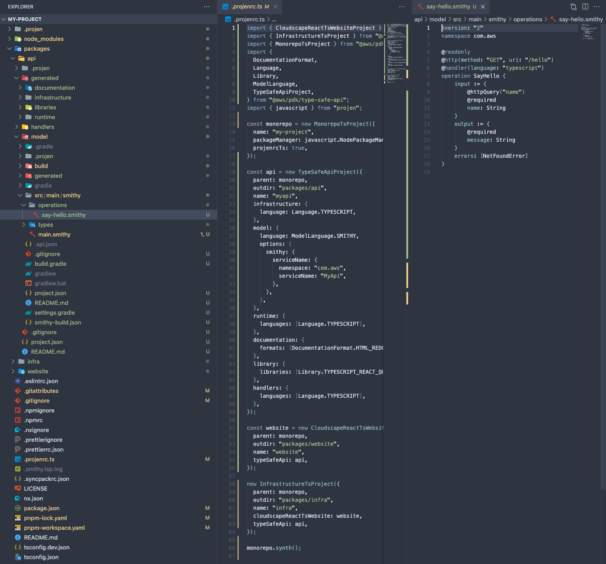
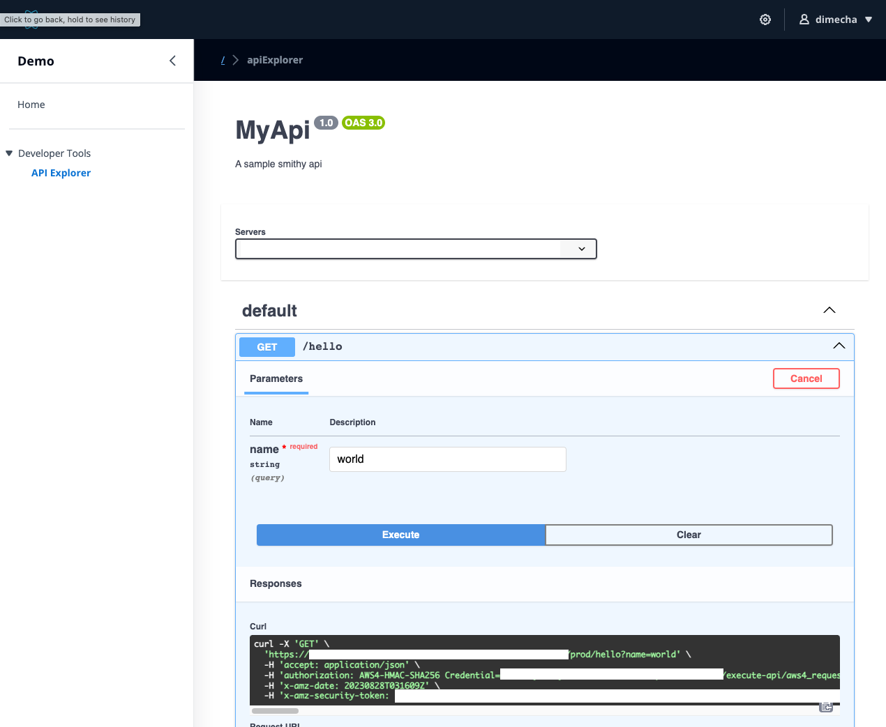

# Getting started

## What is the AWS PDK?

The AWS Project Development Kit (AWS PDK) provides building blocks for common patterns together with development tools to manage and build your projects.

The AWS PDK lets you define your projects programatically via the expressive power of type safe constructs available in one of 3 languages (typescript, python or java). This approach yields many benefits, including:

- Ability to set up new projects within seconds, with all boilerplate already pre-configured.
- Receive updates to previously bootstrapped projects when new versions become available i.e: updated dependenies or lint configurations.
- Build polyglot monorepos, with build caching, cross-language build dependencies, dependency visualization and much more.
- Leverage codified patterns which vend project and infrastructure (CDK) code.

The AWS PDK is built on top of [Projen](https://github.com/projen/projen) and as such all constructs that you compose together need to be defined via a [projenrc](https://projen.io/programmatic-api.html) file.

## Why use the AWS PDK?

It's much easier to show than explain! Here is some PDK code (within projenrc file) that creates a Polyglot monorepo, with a React Website pre-configured with Cognito Auth and pre-integrated with a Smithy Type Safe Api.

```ts
import { CloudscapeReactTsWebsiteProject } from "@aws/pdk/cloudscape-react-ts-website";
import { InfrastructureTsProject } from "@aws/pdk/infrastructure";
import { MonorepoTsProject } from "@aws/pdk/monorepo";
import {
    DocumentationFormat,
    Language,
    Library,
    ModelLanguage,
    TypeSafeApiProject,
} from "@aws/pdk/type-safe-api";
import { javascript } from "projen";

const monorepo = new MonorepoTsProject({
    name: "my-project",
    packageManager: javascript.NodePackageManager.PNPM,
    projenrcTs: true,
});

const api = new TypeSafeApiProject({
    parent: monorepo,
    outdir: "packages/api",
    name: "myapi",
    infrastructure: {
        language: Language.TYPESCRIPT,
    },
    model: {
        language: ModelLanguage.SMITHY,
        options: {
        smithy: {
            serviceName: {
            namespace: "com.aws",
            serviceName: "MyApi",
            },
        },
        },
    },
    runtime: {
        languages: [Language.TYPESCRIPT],
    },
    documentation: {
        formats: [DocumentationFormat.HTML_REDOC],
    },
    library: {
        libraries: [Library.TYPESCRIPT_REACT_QUERY_HOOKS],
    },
    handlers: {
        languages: [Language.TYPESCRIPT],
    },
});

const website = new CloudscapeReactTsWebsiteProject({
    parent: monorepo,
    outdir: "packages/website",
    name: "website",
    typeSafeApi: api,
});

new InfrastructureTsProject({
    parent: monorepo,
    outdir: "packages/infra",
    name: "infra",
    cloudscapeReactTsWebsite: website,
    typeSafeApi: api,
});

monorepo.synth();
```

This code (also available in Python and Java), produces all the source code, packages and infrastructure needed to deploy a fully-operable application in the AWS cloud. All that's left to do is build and deploy it!

From this ~70 lines of code above, the AWS PDK produces the following packages on your behalf:

- `monorepo`: Root level project that manages interdependencies between projects within the Monorepo, provides build caching and dependency visualziation.
- `api/model`: A project that allows you to define your API using Smithy (or OpenAPI) IDL.
- `api/generated/documentation`: A project that automatically creates API documentation in a variety of formats.
- `api/generated/infrastructure`: A project that automatically creates API infrastructure constructs in a type-safe manner.
- `api/generated/libraries`: A project that automatically generates a react hooks library that can be used to call your API from a React based website.
- `api/generated/runtime`: A project that contains server bindings for handlers to ensure type safety.
- `api/handlers`: A project that automatically creates handler stubs, preconfigured with type-safety and a variety of value added features based on your defined API's.
- `website`: A project which creates a React based website built using [Cloudscape](https://cloudscape.design/) that comes pre-integrated with Cognito Auth and your created API. This provides you with the ability to call your API securely.
- `infra`: A project which sets up all CDK related infrastructure needed to deploy your application. It also comes pre-configured to generate a diagram based on your CDK code everytime you build.

### Bootstrapped Source



### Generated Website



### Generated Diagram


As you can see, the AWS PDK provides you with valuable time savings so you can focus on working on what matters most to your project.

## Developing with the AWS PDK

Please refer to the full documentation website.

https://aws.github.io/aws-pdk

## Contributing to the AWS PDK

https://aws.github.io/aws-pdk/contributing/index.html

## License

This project is licensed under the Apache-2.0 License.
