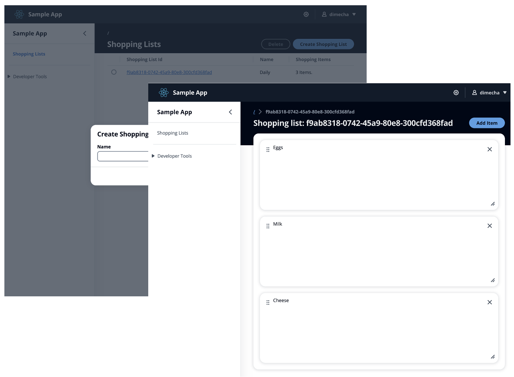
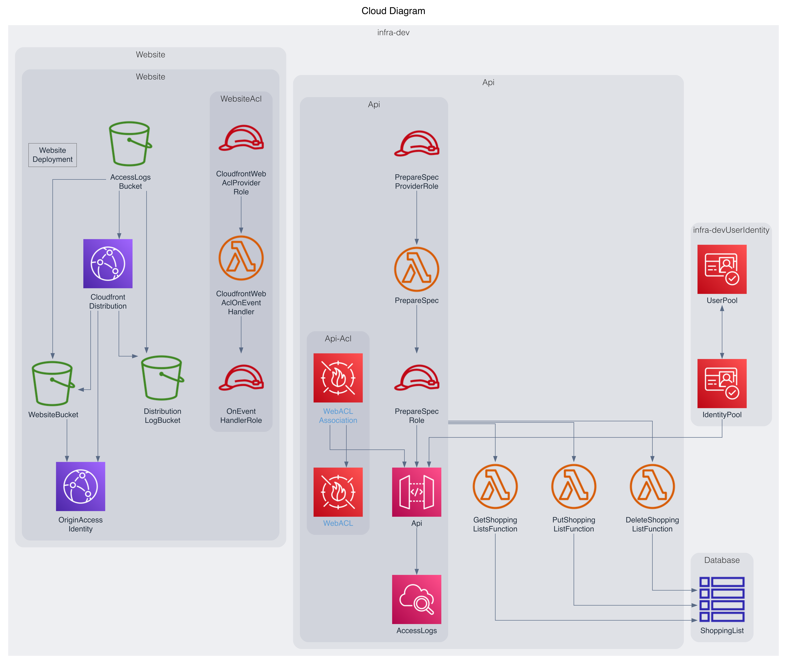
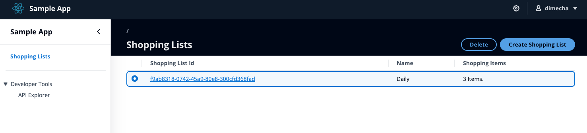

# Create a Shopping List application using the AWS PDK

!!!warning
    The code shown on this page is intended for demonstration purposes only and does not handle edge cases, perform error handling, etc. As such this code should never be used in a production setting.

    Some of the steps in this workshop will create resources that may bill your account. If you do not complete the workshop, you may still have AWS resources that are unknowingly charging your account. To ensure your account is clean after completing this workshop, check out [how to cleanup deployed resources](./your_first_aws_pdk_project.md#destroying-the-deployed-resources).

This workshop will build upon the concepts introduced in the [build your first AWS PDK project](./your_first_aws_pdk_project.md) and dive a little deeper into what a typical development workflow looks like once you set up your core project structure within the AWS PDK.

You will create a Shopping List application that allows you to create & delete shopping lists along with the ability to add, remove and re-order items within those lists.





As part of this workshop, you will learn the following:

- Understand how to make changes to your `projenrc` definition.
- How to define new API operations in [Smithy](https://smithy.io/2.0/quickstart.html).
- Implement business logic for each of your defined API's.
- Set up CDK infrastructure to manage your API and Website.
- Build frontend code using [AWS Cloudscape](https://cloudscape.design/).
- Call your deployed API's using generated type-safe hooks.

## Prerequisites

This is a continuation from [build your first AWS PDK project](./your_first_aws_pdk_project.md) and as such must be completed prior to starting this workshop.

## Submodule 1: Defining your API in Smithy

In order to define our API, we need to write some [Smithy](https://smithy.io/2.0/quickstart.html) code which is contained within `packages/api/model/src/main/smithy`.

!!!info
    More detailed information on how to use smithy can be found in the [Type Safe API Developer Guide](../developer_guides/type-safe-api/using_smithy.md)

### Definining our types

Firstly, let's define some types for our Shopping List application by creating the following files:

=== "types/shopping-list.smithy"

    ```smithy
    $version: "2"
    namespace com.aws

    /// Identifier for a Shopping List
    string ShoppingListId

    /// A Shopping Item is just a string literal
    string ShoppingItem

    /// Defines the id attribute of the Shopping List
    @mixin
    structure ShoppingListIdMixin {
        @required
        shoppingListId: ShoppingListId
    }

    /// Defines the core attributes of a Shopping List
    @mixin
    structure ShoppingListMixin {
        @required
        name: String

        shoppingItems: ShoppingItems
    }

    /// A Shopping List is a union of these Mixins
    structure ShoppingList with [ShoppingListIdMixin, ShoppingListMixin] {}

    /// A collection of Shopping List
    list ShoppingLists {
        member: ShoppingList
    }

    /// A collection of items within a Shopping List
    list ShoppingItems {
        member: ShoppingItem
    }
    ```

=== "types/pagination.smithy"

    ```smithy
    $version: "2"

    namespace com.aws

    /// Extends inputs for "list" type operations to accept pagination details
    @mixin
    structure PaginatedInputMixin {
        /// A token for an additional page of results
        @httpQuery("nextToken")
        nextToken: String

        /// The number of results to return in a page
        @httpQuery("pageSize")
        pageSize: Integer
    }

    /// Extends outputs for "list" type operations to return pagination details
    @mixin
    structure PaginatedOutputMixin {
        /// Pass this in the next request for another page of results
        nextToken: String
    }
    ```

### Define our operations

Now let's define our operations. For this application we need 3 operations as follows:

=== "operations/put-shopping-list.smithy"

    ```smithy
    $version: "2"
    namespace com.aws

    /// Handles upserting of a Shopping List
    @http(method: "POST", uri: "/shopping-list")
    @handler(language: "typescript")
    operation PutShoppingList {
        input := with [ShoppingListMixin] {
            shoppingListId: ShoppingListId
        }
        output := with [ShoppingListIdMixin] {}
        errors: [BadRequestError]
    }
    ```

=== "operations/delete-shopping-list.smithy"

    ```smithy
    $version: "2"
    namespace com.aws

    /// Handles deletion of a Shopping List
    @http(method: "DELETE", uri: "/shopping-list/{shoppingListId}")
    @handler(language: "typescript")
    operation DeleteShoppingList {
        input := {
            @required
            @httpLabel
            shoppingListId: ShoppingListId
        }
        output := with [ShoppingListIdMixin] {}
        errors: [NotFoundError]
    }
    ```

=== "operations/get-shopping-lists.smithy"

    ```smithy
    $version: "2"
    namespace com.aws

    /// Handles fetching of Shopping List(s)
    @readonly
    @http(method: "GET", uri: "/shopping-list")
    @paginated(inputToken: "nextToken", outputToken: "nextToken", pageSize: "pageSize", items: "shoppingLists")
    @handler(language: "typescript")
    operation GetShoppingLists {
        input := with [PaginatedInputMixin] {
            @httpQuery("shoppingListId")
            shoppingListId: ShoppingListId
        }
        output := with [PaginatedOutputMixin] {
            /// List of Shopping List
            @required
            shoppingLists: ShoppingLists
        }
    }
    ```

!!! tip
    The `@handler` trait is used to automatically generate lambda handler stubs within `api/handlers/src`, pre-configured with [AWS Powertools](https://github.com/aws-powertools/) and all type-safe bindings.
    
    You can generate handlers in either `typescript`, `python` or `java` by simply changing the `language` attribute. 

### Expose our operations to the API

The final step is the ensure our operations are exposed as part of the API by listing them in the `operations` field as per the below snippet.

=== "main.smithy"

    ```smithy hl_lines="10"
    $version: "2"
    namespace com.aws

    use aws.protocols#restJson1

    /// A sample smithy api
    @restJson1
    service MyApi {
        version: "1.0"
        operations: [GetShoppingLists, PutShoppingList, DeleteShoppingList]
        errors: [
            BadRequestError
            NotAuthorizedError
            InternalFailureError
        ]
    }
    ```

!!!note
    Given we just removed the `SayHello` operation, we will also need to delete the following files given they are no longer used:

    - `packages/api/model/src/main/smithy/operations/say-hello.smithy`
    - `packages/api/handlers/typescript/src/say-hello.ts`

### Build the API

Now that we have our API defined, the final step is to build our code which will generate all of our type-safe bindings. To do so, run `pdk build` from the root of your PDK project.

Take some time now to inspect the code that was generated for you in the following locations:

- `packages/api/generated/*`: You never need to modify code in the subdirectory, althrough you will reference code within here from your infrastructure and client code (i.e: generated hooks).
- `packages/api/handlers`: All handler stubs are generated in here, based on the presense of the `@handler` trait on your API operations. You will typically write all of your API operation handlers (business logic) within this location.

## Submodule 2: Implement your API operation handlers (business logic)

Having built our project, we should now have access to 3 handler stubs which will be located in the `/packages/api/handlers/typescript/src` directory as follows:

=== "put-shopping-list.ts"

    ```typescript
    import {
        putShoppingListHandler,
        PutShoppingListChainedHandlerFunction,
        INTERCEPTORS,
        Response,
        LoggingInterceptor,
    } from 'myapi-typescript-runtime';

    /**
     * Type-safe handler for the PutShoppingList operation
     */
    export const putShoppingList: PutShoppingListChainedHandlerFunction = async (request) => {
        LoggingInterceptor.getLogger(request).info('Start PutShoppingList Operation');

        // TODO: Implement PutShoppingList Operation. `input` contains the request input.
        const { input } = request;

        return Response.internalFailure({
            message: 'Not Implemented!',
        });
    };

    /**
     * Entry point for the AWS Lambda handler for the PutShoppingList operation.
     * The putShoppingListHandler method wraps the type-safe handler and manages marshalling inputs and outputs
     */
    export const handler = putShoppingListHandler(...INTERCEPTORS, putShoppingList);    
    ```

=== "delete-shopping-list.ts"

    ```typescript
    import {
        deleteShoppingListHandler,
        DeleteShoppingListChainedHandlerFunction,
        INTERCEPTORS,
        Response,
        LoggingInterceptor,
    } from 'myapi-typescript-runtime';

    /**
     * Type-safe handler for the DeleteShoppingList operation
     */
    export const deleteShoppingList: DeleteShoppingListChainedHandlerFunction = async (request) => {
        LoggingInterceptor.getLogger(request).info('Start DeleteShoppingList Operation');

        // TODO: Implement DeleteShoppingList Operation. `input` contains the request input.
        const { input } = request;

        return Response.internalFailure({
            message: 'Not Implemented!',
        });
    };

    /**
     * Entry point for the AWS Lambda handler for the DeleteShoppingList operation.
     * The deleteShoppingListHandler method wraps the type-safe handler and manages marshalling inputs and outputs
     */
    export const handler = deleteShoppingListHandler(...INTERCEPTORS, deleteShoppingList);
    ```

=== "get-shopping-lists.ts"

    ```typescript
    import {
        getShoppingListsHandler,
        GetShoppingListsChainedHandlerFunction,
        INTERCEPTORS,
        Response,
        LoggingInterceptor,
    } from 'myapi-typescript-runtime';

    /**
     * Type-safe handler for the GetShoppingLists operation
     */
    export const getShoppingLists: GetShoppingListsChainedHandlerFunction = async (request) => {
        LoggingInterceptor.getLogger(request).info('Start GetShoppingLists Operation');

        // TODO: Implement GetShoppingLists Operation. `input` contains the request input.
        const { input } = request;

        return Response.internalFailure({
            message: 'Not Implemented!',
        });
    };

    /**
     * Entry point for the AWS Lambda handler for the GetShoppingLists operation.
     * The getShoppingListsHandler method wraps the type-safe handler and manages marshalling inputs and outputs
     */
    export const handler = getShoppingListsHandler(...INTERCEPTORS, getShoppingLists);
    ```

As you can see, these stubs are already configured using the type-safe bindings and all that is left to do is implement them!

### Install any additional dependencies

Before we can start implementing, we need to first add a new dependency on **`@aws-sdk/client-dynamodb`** as we will be using [DynamoDB](https://docs.aws.amazon.com/dynamodb/) to store our Shopping Lists. To do this, modify your `.projenrc.ts` to include the dependency from the handlers package as follows:

```typescript hl_lines="5"
const api = new TypeSafeApiProject({
    ...
});

api.handlers.typescript?.addDeps("@aws-sdk/client-dynamodb");
```

Once you have saved your `.projenrc.ts` file, run `pdk` from the root to synthesize and install your package.

### Implement the handlers

We now have everything we need to start implementing our handlers. Modify the respective handler files with the contents of the following:

=== "put-shopping-list.ts"

    *Creates or updates a Shopping List based on the presense of a shoppingListId. If present, the operation will update the item matching that key otherwise one will be created.*

    ```typescript
    import { randomUUID } from 'crypto';
    import { DynamoDBClient, PutItemCommand } from '@aws-sdk/client-dynamodb';
    import {
        putShoppingListHandler,
        PutShoppingListChainedHandlerFunction,
        INTERCEPTORS,
        Response,
        LoggingInterceptor,
    } from 'myapi-typescript-runtime';

    const dbclient = new DynamoDBClient({ region: process.env.AWS_REGION });

    /**
     * Type-safe handler for the PutShoppingList operation
     */
    export const putShoppingList: PutShoppingListChainedHandlerFunction = async (request) => {
        LoggingInterceptor.getLogger(request).info('Start PutShoppingList Operation');

        const shoppingListId = request.input.body.shoppingListId ?? randomUUID();
        await dbclient.send(new PutItemCommand({
            TableName: 'shopping_list',
            Item: {
                shoppingListId: {
                    S: shoppingListId,
                },
                name: {
                    S: request.input.body.name,
                },
                shoppingItems: {
                    S: JSON.stringify(request.input.body.shoppingItems || []),
                },
            },
        }));

        return Response.success({
            shoppingListId,
        });
    };

    /**
     * Entry point for the AWS Lambda handler for the PutShoppingList operation.
     * The putShoppingListHandler method wraps the type-safe handler and manages marshalling inputs and outputs
     */
    export const handler = putShoppingListHandler(...INTERCEPTORS, putShoppingList);
    ```

=== "delete-shopping-list.ts"

    *Deletes a Shopping List given a shoppingListId.*

    ```typescript
    import { DeleteItemCommand, DynamoDBClient } from '@aws-sdk/client-dynamodb';
    import {
        deleteShoppingListHandler,
        DeleteShoppingListChainedHandlerFunction,
        INTERCEPTORS,
        Response,
        LoggingInterceptor,
    } from 'myapi-typescript-runtime';

    const dbclient = new DynamoDBClient({ region: process.env.AWS_REGION });

    /**
     * Type-safe handler for the DeleteShoppingList operation
     */
    export const deleteShoppingList: DeleteShoppingListChainedHandlerFunction = async (request) => {
        LoggingInterceptor.getLogger(request).info(
            'Start DeleteShoppingList Operation',
        );

        const shoppingListId = request.input.requestParameters.shoppingListId;
        await dbclient.send(
        new DeleteItemCommand({
            TableName: 'shopping_list',
            Key: {
                shoppingListId: {
                    S: shoppingListId,
                },
            },
        }),
        );

        return Response.success({
            shoppingListId,
        });
    };

    /**
     * Entry point for the AWS Lambda handler for the DeleteShoppingList operation.
     * The deleteShoppingListHandler method wraps the type-safe handler and manages marshalling inputs and outputs
     */
    export const handler = deleteShoppingListHandler(
        ...INTERCEPTORS,
        deleteShoppingList,
    );
    ```

=== "get-shopping-lists.ts"
    
    *This logic either calls the Scan or Query command depending on the presense of a shoppingListId request parameter. It also handles pagination based on the presense of a pageSize and/or nextToken. The shoppingItems are stored as a serialized JSON string in the table/*

    ```typescript
    import { DynamoDBClient, QueryCommand, ScanCommand } from '@aws-sdk/client-dynamodb';
    import {
        getShoppingListsHandler,
        GetShoppingListsChainedHandlerFunction,
        INTERCEPTORS,
        Response,
        LoggingInterceptor,
        ShoppingList,
    } from 'myapi-typescript-runtime';

    const dbclient = new DynamoDBClient({ region: process.env.AWS_REGION });

    /**
     * Type-safe handler for the GetShoppingLists operation
     */
    export const getShoppingLists: GetShoppingListsChainedHandlerFunction = async (request) => {
        LoggingInterceptor.getLogger(request).info('Start GetShoppingLists Operation');

        const nextToken = request.input.requestParameters.nextToken;
        const pageSize = request.input.requestParameters.pageSize;
        const shoppingListId = request.input.requestParameters.shoppingListId;
        const Command = shoppingListId ? QueryCommand : ScanCommand;

        const response = await dbclient.send(new Command({
            TableName: 'shopping_list',
            ConsistentRead: true,
            Limit: pageSize,
            ExclusiveStartKey: nextToken ? fromToken(nextToken) : undefined,
            ...(shoppingListId ? {
            KeyConditionExpression: 'shoppingListId = :shoppingListId',
            ExpressionAttributeValues: {
                ':shoppingListId': {
                    S: request.input.requestParameters.shoppingListId!,
                },
            },
            } : {}),
        }));

        return Response.success({
            shoppingLists: (response.Items || [])
                .map<ShoppingList>(item => ({
                    shoppingListId: item.shoppingListId.S!,
                    name: item.name.S!,
                    shoppingItems: JSON.parse(item.shoppingItems.S || '[]'),
                })),
            nextToken: response.LastEvaluatedKey ? toToken(response.LastEvaluatedKey) : undefined,
        });
    };

    /**
     * Decode a stringified token
     * @param token a token passed to the paginated request
     */
    const fromToken = <T>(token?: string): T | undefined =>
        token ? (JSON.parse(Buffer.from(decodeURIComponent(token), 'base64').toString()) as T) : undefined;

    /**
     * Encode pagination details into an opaque stringified token
     * @param paginationToken pagination token details
     */
    const toToken = <T>(paginationToken?: T): string | undefined =>
        paginationToken ? encodeURIComponent(Buffer.from(JSON.stringify(paginationToken)).toString('base64')) : undefined;

    /**
     * Entry point for the AWS Lambda handler for the GetShoppingLists operation.
     * The getShoppingListsHandler method wraps the type-safe handler and manages marshalling inputs and outputs
     */
    export const handler = getShoppingListsHandler(...INTERCEPTORS, getShoppingLists);
    ```

Fantastic! We now have all of our API business logic implemented. Let's move on to configuring the API infrastructure and deploying what we have so far.

## Submodule 3: Configure and deploy your API

### Create a Database construct

We need to create a DynamoDB table so that we can perform CRUD operations on our Shopping List(s). To do this, create a new file `packages/infra/src/constructs/database.ts` as follows:

```typescript
import { AttributeType, Table } from "aws-cdk-lib/aws-dynamodb";
import { Construct } from "constructs";

/**
 * Database construct to deploy a DynamoDB table.
 */
export class DatabaseConstruct extends Construct {
  public readonly shoppingListTable: Table;

  constructor(scope: Construct, id: string) {
    super(scope, id);

    this.shoppingListTable = new Table(this, "ShoppingList", {
      partitionKey: {
        name: "shoppingListId",
        type: AttributeType.STRING,
      },
      tableName: "shopping_list",
    });
  }
}
```

### Modify API construct

We now need to wire up all of the handlers that we implemented into the existing `ApiConstruct`. We additionally need to configure each of our operations specific permissions onto the dynamoDB table that we just configured. Perform the following highlighted changes to your `packages/infra/src/constructs/api.ts` file:

```typescript hl_lines="15-19 30-33 48-59 67-77 102-108"
import { UserIdentity } from "@aws/pdk/identity";
import { Authorizers, Integrations } from "@aws/pdk/type-safe-api";
import { Stack } from "aws-cdk-lib";
import { Cors } from "aws-cdk-lib/aws-apigateway";
import {
  AccountPrincipal,
  AnyPrincipal,
  Effect,
  PolicyDocument,
  PolicyStatement,
} from "aws-cdk-lib/aws-iam";
import { Construct } from "constructs";
import {
  Api,
  DeleteShoppingListFunction,
  GetShoppingListsFunction,
  PutShoppingListFunction,
} from "myapi-typescript-infra";
import { DatabaseConstruct } from "./database";

/**
 * Api construct props.
 */
export interface ApiConstructProps {
  /**
   * Instance of the UserIdentity.
   */
  readonly userIdentity: UserIdentity;

  /**
   * Instance of the DatabaseConstruct.
   */
  readonly databaseConstruct: DatabaseConstruct;
}

/**
 * Infrastructure construct to deploy a Type Safe API.
 */
export class ApiConstruct extends Construct {
  /**
   * API instance
   */
  public readonly api: Api;

  constructor(scope: Construct, id: string, props?: ApiConstructProps) {
    super(scope, id);

    const putShoppingListFunction = new PutShoppingListFunction(
      this,
      "PutShoppingListFunction",
    );
    const deleteShoppingListFunction = new DeleteShoppingListFunction(
      this,
      "DeleteShoppingListFunction",
    );
    const getShoppingListsFunction = new GetShoppingListsFunction(
      this,
      "GetShoppingListsFunction",
    );

    this.api = new Api(this, id, {
      defaultAuthorizer: Authorizers.iam(),
      corsOptions: {
        allowOrigins: Cors.ALL_ORIGINS,
        allowMethods: Cors.ALL_METHODS,
      },
      integrations: {
        putShoppingList: {
          integration: Integrations.lambda(putShoppingListFunction),
        },
        deleteShoppingList: {
          integration: Integrations.lambda(deleteShoppingListFunction),
        },
        getShoppingLists: {
          integration: Integrations.lambda(getShoppingListsFunction),
        },
      },
      policy: new PolicyDocument({
        statements: [
          // Here we grant any AWS credentials from the account that the prototype is deployed in to call the api.
          // Machine to machine fine-grained access can be defined here using more specific principals (eg roles or
          // users) and resources (ie which api paths may be invoked by which principal) if required.
          // If doing so, the cognito identity pool authenticated role must still be granted access for cognito users to
          // still be granted access to the API.
          new PolicyStatement({
            effect: Effect.ALLOW,
            principals: [new AccountPrincipal(Stack.of(this).account)],
            actions: ["execute-api:Invoke"],
            resources: ["execute-api:/*"],
          }),
          // Open up OPTIONS to allow browsers to make unauthenticated preflight requests
          new PolicyStatement({
            effect: Effect.ALLOW,
            principals: [new AnyPrincipal()],
            actions: ["execute-api:Invoke"],
            resources: ["execute-api:/*/OPTIONS/*"],
          }),
        ],
      }),
    });

    // Grant our lambda functions scoped access to call Dynamo
    props?.databaseConstruct.shoppingListTable.grantReadData(
      getShoppingListsFunction,
    );
    [putShoppingListFunction, deleteShoppingListFunction].forEach(
      (f) => props?.databaseConstruct.shoppingListTable.grantWriteData(f),
    );

    // Grant authenticated users access to invoke the api
    props?.userIdentity.identityPool.authenticatedRole.addToPrincipalPolicy(
      new PolicyStatement({
        effect: Effect.ALLOW,
        actions: ["execute-api:Invoke"],
        resources: [this.api.api.arnForExecuteApi("*", "/*", "*")],
      }),
    );
  }
}
```

You will notice that we are importing `DeleteShoppingListFunction, GetShoppingListsFunction & PutShoppingListFunction` from the `myapi-typescript-infra` package. These are extensions to [`Function`](https://docs.aws.amazon.com/cdk/api/v2/docs/aws-cdk-lib.aws_lambda.Function.html) which come pre-configured with runtime, index handler and asset location. The function accepts an optional third parameter which allows you to adjust any settings you would find within the `Function` interface i.e: vpc, subnets, etc.

### Wire in the DatabaseConstruct

The final change we need to make is that we need to instantiate the `DatabaseConstruct` and pass the instance to the `ApiConstruct`. To do this, perform the following highlighted changes to `packages/infra/src/stacks/application-stack.ts`:

```typescript hl_lines="5 13 15"
import { UserIdentity } from "@aws/pdk/identity";
import { Stack, StackProps } from "aws-cdk-lib";
import { Construct } from "constructs";
import { ApiConstruct } from "../constructs/api";
import { DatabaseConstruct } from "../constructs/database";
import { WebsiteConstruct } from "../constructs/website";

export class ApplicationStack extends Stack {
  constructor(scope: Construct, id: string, props?: StackProps) {
    super(scope, id, props);

    const userIdentity = new UserIdentity(this, `${id}UserIdentity`);
    const databaseConstruct = new DatabaseConstruct(this, "Database");
    const apiConstruct = new ApiConstruct(this, "Api", {
      databaseConstruct,
      userIdentity,
    });
    new WebsiteConstruct(this, "Website", { userIdentity, apiConstruct });
  }
}
```

### Deploy our updated API

We are now ready to deploy our API. To do so, run the following steps:

```bash
pdk build
cd packages/infra
pdk run deploy --require-approval never
```

Once the deployment completes, we can test our API by navigating the the website (either via Cloudfront or locally) and trying out the API Explorer.

!!!tip
    Ensure you have [configured you local website to communicate with backend services](./your_first_aws_pdk_project.md#configuring-your-local-website-to-communicate-with-backend-services), otherwise your website will not function correctly.

## Submodule 4: Build a Shopping List UI

Now that we have tested our API and shown that it works, we can now start building out a UI to improve the user experience.

Since we will no longer be using the `Home` page, we can simplify delete it from `pages/Home/index.tsx` along with it's `pages/Home` folder.

### Create new pages & components

Within the `packages/website/src` directory, create the following three files with content as follows:

=== "pages/ShoppingLists/index.tsx"

    This creates the UI do managing our shoppings lists.

    ```typescript
    /* eslint-disable @typescript-eslint/no-floating-promises */
    import {
      Button,
      Header,
      Link,
      SpaceBetween,
      Table,
      TableProps,
    } from "@cloudscape-design/components";
    import {
      ShoppingList,
      usePutShoppingList,
      useDeleteShoppingList,
      useGetShoppingLists,
    } from "myapi-typescript-react-query-hooks";
    import { useContext, useEffect, useMemo, useState } from "react";
    import { useNavigate } from "react-router-dom";
    import CreateItem from "../../components/CreateItem";
    import { AppLayoutContext } from "../../layouts/App";

    /**
     * Component to render the ShoppingLists "/" route.
     */
    const ShoppingLists: React.FC = () => {
      const [visibleModal, setVisibleModal] = useState(false);
      const [selectedShoppingList, setSelectedShoppingList] = useState<
        ShoppingList[]
      >([]);
      const getShoppingLists = useGetShoppingLists({ pageSize: 50 });
      const putShoppingList = usePutShoppingList();
      const deleteShoppingList = useDeleteShoppingList();
      const navigate = useNavigate();
      const { setAppLayoutProps } = useContext(AppLayoutContext);
    
      useEffect(() => {
        setAppLayoutProps({
          contentType: "table",
        });
      }, [setAppLayoutProps]);
    
      const columnDefinitions = useMemo<
        TableProps.ColumnDefinition<ShoppingList>[]
      >(
        () => [
          {
            id: "shoppingListId",
            isRowHeader: true,
            header: "Shopping List Id",
            cell: (cell) => (
              <Link
                href={`/${cell.shoppingListId}`}
                onFollow={(e) => {
                  e.preventDefault();
                  navigate(`/${cell.shoppingListId}`);
                }}
              >
                {cell.shoppingListId}
              </Link>
            ),
          },
          {
            id: "name",
            header: "Name",
            cell: (cell) => cell.name,
          },
          {
            id: "shoppingItems",
            header: "Shopping Items",
            cell: (cell) => `${cell.shoppingItems?.length || 0} Items.`,
          },
        ],
        [navigate],
      );
    
      return (
        <>
          <CreateItem
            title="Create Shopping List"
            callback={async (item) => {
              await putShoppingList.mutateAsync({
                putShoppingListRequestContent: {
                  name: item,
                },
              });
              getShoppingLists.refetch();
            }}
            isLoading={putShoppingList.isLoading}
            visibleModal={visibleModal}
            setVisibleModal={setVisibleModal}
          />
          <Table
            selectionType="single"
            stickyHeader={true}
            selectedItems={selectedShoppingList}
            onSelectionChange={(e) =>
              setSelectedShoppingList(e.detail.selectedItems)
            }
            header={
              <Header
                variant="awsui-h1-sticky"
                actions={
                  <SpaceBetween size="xs" direction="horizontal">
                    <Button
                      loading={deleteShoppingList.isLoading}
                      data-testid="header-btn-delete"
                      disabled={selectedShoppingList.length === 0}
                      onClick={async () => {
                        await deleteShoppingList.mutateAsync({
                          shoppingListId: selectedShoppingList![0].shoppingListId,
                        });
                        setSelectedShoppingList([]);
                        getShoppingLists.refetch();
                      }}
                    >
                      Delete
                    </Button>
                    <Button
                      data-testid="header-btn-create"
                      variant="primary"
                      onClick={() => setVisibleModal(true)}
                    >
                      Create Shopping List
                    </Button>
                  </SpaceBetween>
                }
              >
                Shopping Lists
              </Header>
            }
            variant="full-page"
            items={getShoppingLists.data?.pages[0].shoppingLists!}
            columnDefinitions={columnDefinitions}
          />
        </>
      );
    };
    
    export default ShoppingLists;    
    ```

=== "pages/ShoppingList/index.tsx"

    This creates the UI for managing a shopping list's items, re-arranging them, etc.

    ```typescript
    /* eslint-disable @typescript-eslint/no-floating-promises */
    import {
      Board,
      BoardItem,
      BoardProps,
    } from "@cloudscape-design/board-components";
    import {
      Button,
      Container,
      ContentLayout,
      Header,
      SpaceBetween,
      Spinner,
    } from "@cloudscape-design/components";
    import {
      ShoppingList as _ShoppingList,
      usePutShoppingList,
      useGetShoppingLists,
    } from "myapi-typescript-react-query-hooks";
    import { useEffect, useState } from "react";
    import { useParams } from "react-router-dom";
    import CreateItem from "../../components/CreateItem";
    
    type ListItem = { name: string };
    
    /**
     * Component to render a singular Shopping List "/:shoppingListId" route.
     */
    const ShoppingList: React.FC = () => {
      const { shoppingListId } = useParams();
      const [visibleModal, setVisibleModal] = useState(false);
      const getShoppingLists = useGetShoppingLists({ shoppingListId });
      const putShoppingList = usePutShoppingList();
      const shoppingList: _ShoppingList | undefined =
        getShoppingLists.data?.pages[0].shoppingLists[0]!;
      const [shoppingItems, setShoppingItems] =
        useState<BoardProps.Item<ListItem>[]>();
    
      useEffect(() => {
        setShoppingItems(
          shoppingList?.shoppingItems?.map((i) => ({
            id: i,
            definition: { minColumnSpan: 4 },
            data: { name: i },
          })),
        );
      }, [shoppingList?.shoppingItems]);
    
      return (
        <ContentLayout
          header={
            <Header
              variant="awsui-h1-sticky"
              actions={
                <SpaceBetween size="xs" direction="horizontal">
                  <Button
                    data-testid="header-btn-create"
                    variant="primary"
                    onClick={() => setVisibleModal(true)}
                  >
                    Add Item
                  </Button>
                </SpaceBetween>
              }
            >
              Shopping list: {shoppingList?.name}
            </Header>
          }
        >
          <CreateItem
            isLoading={false}
            title="Add Item"
            callback={async (item) => {
              const items = [
                ...(shoppingItems || []),
                {
                  id: item,
                  definition: { minColumnSpan: 4 },
                  data: { name: item },
                },
              ];
              setShoppingItems(items);
              putShoppingList.mutate({
                putShoppingListRequestContent: {
                  name: shoppingList.name,
                  shoppingListId: shoppingList.shoppingListId,
                  shoppingItems: items.map((i) => i.data.name),
                },
              });
            }}
            visibleModal={visibleModal}
            setVisibleModal={setVisibleModal}
          />
          <Container>
            {!shoppingList ? (
              <Spinner />
            ) : (
              <Board<ListItem>
                onItemsChange={(event) => {
                  const items = event.detail.items as BoardProps.Item<ListItem>[];
                  setShoppingItems(items);
                  putShoppingList.mutate({
                    putShoppingListRequestContent: {
                      name: shoppingList.name,
                      shoppingListId: shoppingList.shoppingListId,
                      shoppingItems: items.map((i) => i.data.name),
                    },
                  });
                }}
                items={shoppingItems || []}
                renderItem={(item, actions) => (
                  <BoardItem
                    header={item.data.name}
                    settings={
                      <Button
                        iconName="close"
                        variant="icon"
                        onClick={actions.removeItem}
                      />
                    }
                    i18nStrings={{
                      dragHandleAriaLabel: "Drag handle",
                      dragHandleAriaDescription:
                        "Use Space or Enter to activate drag, arrow keys to move, Space or Enter to submit, or Escape to discard.",
                      resizeHandleAriaLabel: "Resize handle",
                      resizeHandleAriaDescription:
                        "Use Space or Enter to activate resize, arrow keys to move, Space or Enter to submit, or Escape to discard.",
                    }}
                  />
                )}
                i18nStrings={{
                  liveAnnouncementDndCommitted: () => "",
                  liveAnnouncementDndDiscarded: () => "",
                  liveAnnouncementDndItemInserted: () => "",
                  liveAnnouncementDndItemReordered: () => "",
                  liveAnnouncementDndItemResized: () => "",
                  liveAnnouncementDndStarted: () => "",
                  liveAnnouncementItemRemoved: () => "",
                  navigationAriaLabel: "",
                  navigationItemAriaLabel: () => "",
                }}
                empty={<></>}
              />
            )}
          </Container>
        </ContentLayout>
      );
    };
    
    export default ShoppingList;
    ```

=== "components/CreateItem/index.tsx"

    Abstract widget to 'add an item'.

    ```typescript
    /* eslint-disable @typescript-eslint/no-floating-promises */
    import {
      Box,
      Button,
      FormField,
      Input,
      Modal,
      SpaceBetween,
    } from "@cloudscape-design/components";
    import { useState } from "react";
    
    /**
     * Component to render a widget to add an item.
     */
    const CreateItem: React.FC<{
      title: string;
      visibleModal: boolean;
      isLoading: boolean;
      setVisibleModal: (visible: boolean) => void;
      callback: (itemName: string) => Promise<void>;
    }> = ({ title, visibleModal, setVisibleModal, callback, isLoading }) => {
      const [showValidation, setShowValidation] = useState(false);
      const [itemToCreate, setItemToCreate] = useState<string | undefined>();
      return (
        <Modal
          onDismiss={() => setVisibleModal(false)}
          visible={visibleModal}
          footer={
            <Box float="right">
              <SpaceBetween direction="horizontal" size="xs">
                <Button
                  variant="link"
                  onClick={() => {
                    setVisibleModal(false);
                    setItemToCreate(undefined);
                    setShowValidation(false);
                  }}
                >
                  Cancel
                </Button>
                <Button
                  variant="primary"
                  loading={isLoading}
                  onClick={async () => {
                    setShowValidation(true);
                    if (!itemToCreate) {
                      return;
                    }
                    await callback(itemToCreate);
                    setVisibleModal(false);
                    setItemToCreate(undefined);
                    setShowValidation(false);
                  }}
                >
                  Create
                </Button>
              </SpaceBetween>
            </Box>
          }
          header={title}
        >
          <FormField
            label="Name"
            errorText={
              showValidation && !itemToCreate ? `Name must be provided` : undefined
            }
          >
            <Input
              value={itemToCreate || ""}
              onChange={({ detail }) => setItemToCreate(detail.value)}
            />
          </FormField>
        </Modal>
      );
    };
    
    export default CreateItem;
    ```
    
### Wire in the new pages

Next we need to modify the following two files in order to instrument the new pages correctly:

=== "layouts/App/navitems.ts"

    Render the new pages as "Shopping Lists" in the nav bar.

    ```typescript hl_lines="7"
    import { SideNavigationProps } from "@cloudscape-design/components";

    /**
     * Define your Navigation Items here
     */
    export const NavItems: SideNavigationProps.Item[] = [
        { text: "Shopping Lists", type: "link", href: "/" },
        { type: "divider" },
        {
            text: "Developer Tools",
            type: "expandable-link-group",
            href: "#",
            defaultExpanded: false,
            items: [{ text: "API Explorer", type: "link", href: "/apiExplorer" }],
        },
    ];
    ```

=== "layouts/Routes/index.tsx"

    Set up new routes (and remove old ones).

    ```typescript hl_lines="4-5 13-14"
    import * as React from "react";
    import { Route, Routes as ReactRoutes } from "react-router-dom";
    import ApiExplorer from "../../pages/ApiExplorer";
    import ShoppingList from "../../pages/ShoppingList";
    import ShoppingLists from "../../pages/ShoppingLists";

    /**
     * Defines the Routes.
     */
    const Routes: React.FC = () => {
    return (
        <ReactRoutes>
            <Route key={0} path="/" element={<ShoppingLists />} />
            <Route key={1} path="/:shoppingListId" element={<ShoppingList />} />
            <Route key={2} path="/apiExplorer" element={<ApiExplorer />} />
        </ReactRoutes>
    );
    };

    export default Routes;
    ```

### Testing out our new UI

We can now test our UI locally by running the following command:

```bash
cd packages/website
pdk dev
```

This will load a local server and open a browser showing your new application.



Have a play around with your website to ensure it is working as expected.

### Deploying our website to Cloudfront

If you are happy with your website locally, you can go ahead and deploy it to AWS Cloudfront by performing the following steps from the root directory:

```bash
pdk build
cd packages/infra
pdk run deploy --require-approval never
```

Once the deployment completes, navigate to your cloudfront URL to play around with your deployed website.

## Next Steps

Congratulations, you have now familiarized yourself with the PDK using a real-world example! Where do you go from here?

- See the [Developer Guide](../developer_guides/index.md) to begin exploring the provided constructs available in the PDK.
- See the [API reference](../api/index.md) to view [Js/Java/Py]Docs for each provided PDK construct.
- The AWS PDK is an [open-source project](https://github.com/aws/aws-pdk). Want to [contribute](../contributing/index.md)?
