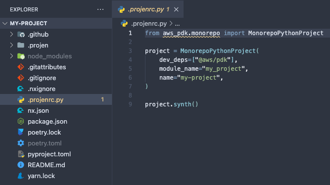
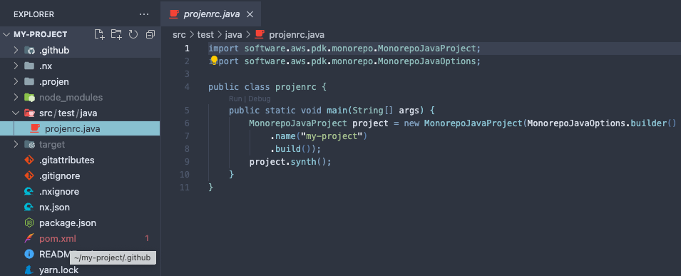

# Your first AWS PDK Project

!!!warning
    Some of the steps in this workshop will create resources that may bill your account. If you do not complete the workshop, you may still have AWS resources that are unknowingly charging your account. To ensure your account is clean after completing this workshop, check out the [destroying the deployed resources](./your_first_aws_pdk_project.md#destroying-the-deployed-resources) section towards the end of this page.

You've read [Getting started with the AWS PDK](index.md) and set up your development environment for writing AWS PDK projects? Great! Now let's see how it feels to work with the AWS PDK by building a complex PDK project.

In this tutorial, you'll learn about the following:

- The structure of a PDK project
- How to use PDK constructs to define a project structure
- How to synthesize and build PDK projects
- How to take advantage of build caching and visualize your project dependencies

The standard AWS PDK development workflow is similar to the standard Projen workflow you may already be familiar with:

1. Bootstrap your project by executing the `pdk new monorepo-[ts/py/java]` command
1. Define your project constructs within the `projenrc` file
1. Synthesize your projects by running the `pdk` command
1. Build your projects by running `pdk build`
1. Deploy your infrastructure to the AWS cloud

This tutorial walks you through creating the PDK Project from start to finish. The final application we create will comprise of a React based website, a Smithy API and the supporting CDK infrastructure to deploy it all.

We'll also show how to add a new API operation, implement an API handler, and wire it up in your infrastructure.

## Prerequisites

Refer to [prerequisites](./index.md#prerequisites).

## Create your project

Each AWS PDK based project should be in its own directory. Create a new directory for your project. Starting in your home directory, or another directory if you prefer, issue the following commands:

```bash
mkdir my-project
cd my-project
```

Now lets bootstrap our project to use the PDK by running the `pdk new` command. Specify the desired template to bootstrap with based on your desired programming language:

=== "TYPESCRIPT"

    ```bash
    # optional params can be passed in also - lets use PNPM to manage deps :)
    pdk new --package-manager=pnpm monorepo-ts
    ```

=== "PYTHON"

    ```bash
    pdk new monorepo-py
    ```

=== "JAVA"

    ```bash
    pdk new monorepo-java
    ```

The `pdk new` command creates a number of files and folders inside the my-project directory to help you organize the source code for your AWS PDK based project. It also installs any dependencies on your behalf by default, although this can be suppressed with the optional `--no-post` argument.

!!!tip
    If you have Git installed, each project you create using `pdk new` is also initialized as a Git repository. We'll ignore that for now, but it's there when you need it.

Let's take a moment to examine the project structure that is created for you:

=== "TYPESCRIPT"
    

=== "PYTHON"
    

=== "JAVA"
    

As you can see, alot of files have been created for you and each of these are managed by the PDK/Projen on your behalf. The only file you need to modify is the `projenrc` file which is repsonsible for synthesizing each of these files.

!!!warning
    It is important that you never modify synthesized files directly as it will result in your changes being overriden the next time you run the `pdk` command which will re-synthesize/override them.

Inspecting the `projenrc` file, we notice that a single construct is instantiated that represents the monorepo itself. Within this construct you can add new dependencies, update tsconfig, npmignore, gitignore, etc. In the default configuration, the following apply:

- The name of the project takes on the name of the folder it was created in.
- For typescript, the packageManager is set to `PNPM` as we passed this optional parameter in whilst running `pdk new`.
    - Any parameter listed here can be passed in via the `pdk new` command i.e: `--name="some-other-name"`.
- For python, the moduleName defaults to a snake-cased project name.

You will also notice that the `synth()` method is called on this instance at the end of the file. When you run the `pdk` command, this file will be executed by your runtime and will synthesize this instance which will result in all the files that you see in the previous image.

!!!info
    Whenever you change the `projenrc` file, make sure you run the `pdk` command from the root of your project to ensure your files are synthesized.

For more details on the `Monorepo` construct, please refer to the [Monorepo Developer Guide](../developer_guides/monorepo/index.md).

## Building your project

We now have a monorepo that can be used to manage projects and perform polyglot builds. Let's now test to make sure the build process works.

To build your project, run the following command from the root of your project `pdk build`. This command delegates to `NX` under the covers which calls the `build` target for each of your subprojects in dependency-order. Given we don't have any subprojects at present we should see the following output:

```bash
pdk build

👾 build | npx nx run-many --target=build --output-style=stream --nx-bail

 >  NX   No projects with target build for 0 projects were run

 ———————————————————————————————————————————————————————————————————————————————————————————————————————————————————————————————

 >  NX   Successfully ran target build for 0 projects
```

In future, when we add new sub-projects to the monorepo - we will see the output from each individual sub-projects build task.

## Add a Type-Safe API to your monorepo

At this point, your monorepo project doesn't do anything because the `projenrc` file only defines the monorepo itself and no other sub-projects which isn't useful. Let's make things more interesting and add a Type-Safe API.

The Type-Safe API construct is available within the AWS PDK library which is installed by default, so there is no need to install another library. We can define the Type-Safe API within the `projenrc` file as follows:

=== "TYPESCRIPT"

    ```ts
    import { MonorepoTsProject } from "@aws/pdk/monorepo";
    import {
        DocumentationFormat,
        Language,
        Library,
        ModelLanguage,
        TypeSafeApiProject,
    } from "@aws/pdk/type-safe-api";
    import { javascript } from "projen";

    // rename variable to monorepo for better readability
    const monorepo = new MonorepoTsProject({
        name: "my-project",
        packageManager: javascript.NodePackageManager.PNPM,
        projenrcTs: true,
    });

    new TypeSafeApiProject({
        parent: monorepo,
        outdir: "packages/api",
        name: "myapi",
        infrastructure: {
            language: Language.TYPESCRIPT,
        },
        model: {
            language: ModelLanguage.SMITHY,
            options: {
            smithy: {
                serviceName: {
                namespace: "com.aws",
                serviceName: "MyApi",
                },
            },
            },
        },
        runtime: {
            languages: [Language.TYPESCRIPT],
        },
        documentation: {
            formats: [DocumentationFormat.HTML_REDOC],
        },
        library: {
            libraries: [Library.TYPESCRIPT_REACT_QUERY_HOOKS],
        },
        handlers: {
            languages: [Language.TYPESCRIPT],
        },
    });

    monorepo.synth();
    ```

=== "PYTHON"

    ```python
    from aws_pdk.monorepo import MonorepoPythonProject
    from aws_pdk.type_safe_api import *

    # rename variable to monorepo for better readability
    monorepo = MonorepoPythonProject(
        module_name="my_project",
        name="my-project",
    )

    TypeSafeApiProject(
        name="myapi",
        parent=monorepo,
        outdir="packages/api",
        model=ModelConfiguration(
            language=ModelLanguage.SMITHY,
            options=ModelOptions(
                smithy=SmithyModelOptions(
                    service_name=SmithyServiceName(
                        namespace="com.amazon",
                        service_name="MyAPI"
                    )
                )
            )
        ),
        runtime=RuntimeConfiguration(
            languages=[Language.PYTHON]
        ),
        infrastructure=InfrastructureConfiguration(
            language=Language.PYTHON
        ),
        documentation=DocumentationConfiguration(
            formats=[DocumentationFormat.HTML_REDOC]
        ),
        handlers=HandlersConfiguration(
            languages=[Language.PYTHON]
        ),
        library=LibraryConfiguration(
            libraries=[Library.TYPESCRIPT_REACT_QUERY_HOOKS]
        )
    )

    monorepo.synth()
    ```

=== "JAVA"

    ```java
    import software.aws.pdk.monorepo.MonorepoJavaProject;
    import software.aws.pdk.type_safe_api.*;
    import software.aws.pdk.monorepo.MonorepoJavaOptions;
    import java.util.Arrays;

    public class projenrc {
        public static void main(String[] args) {
            // rename variable to monorepo for better readability
            MonorepoJavaProject monorepo = new MonorepoJavaProject(MonorepoJavaOptions.builder()
                    .name("my-project")
                    .build());

            new TypeSafeApiProject(TypeSafeApiProjectOptions.builder()
                    .name("myapi")
                    .parent(monorepo)
                    .outdir("packages/api")
                    .model(ModelConfiguration.builder()
                            .language(ModelLanguage.SMITHY)
                            .options(ModelOptions.builder()
                                    .smithy(SmithyModelOptions.builder()
                                            .serviceName(SmithyServiceName.builder()
                                                    .namespace("com.my.company")
                                                    .serviceName("MyApi")
                                                    .build())
                                            .build())
                                    .build())
                            .build())
                    .runtime(RuntimeConfiguration.builder()
                            .languages(Arrays.asList(Language.JAVA))
                            .build())
                    .infrastructure(InfrastructureConfiguration.builder()
                            .language(Language.JAVA)
                            .build())
                    .documentation(DocumentationConfiguration.builder()
                            .formats(Arrays.asList(DocumentationFormat.HTML_REDOC))
                            .build())
                    .library(LibraryConfiguration.builder()
                            .libraries(Arrays.asList(Library.TYPESCRIPT_REACT_QUERY_HOOKS))
                            .build())
                    .handlers(HandlersConfiguration.builder()
                            .languages(Arrays.asList(Language.JAVA))
                            .build())
                    .build());

            monorepo.synth();
        }
    }
    ```

As we have now modified the `projenrc` file, let's synthesize our project by running `pdk` from the root of the project.

You will now notice that a new `packages/api` folder will be created within your project which contains all of the API related source code for your configured Type-Safe API. In summary, the packages contained within the `packages/api` folder have the following functions:

```
|_ model/ - contains the Interface Definition Language (IDL) where you define your API.
|_ handlers/ - contains the generated lambda stubs for your API operations
|_ generated/
    |_ runtime/ - generated types, client, and server code in the languages you specified
    |_ infrastructure/ - generated infrastructure
    |_ documentation/ - generated documentation in the formats you specified
    |_ library/ - generated libraries if specified
        |_ typescript-react-query-hooks - react hooks to call the API
```

For more details on these packages, refer to the [Type-Safe API Developer Guide](../developer_guides/type-safe-api/index.md).

Now, lets build our API by running `pdk build` from the root of our monorepo. You will notice that each package in the monorepo is built in dependency order.

!!!tip
    If you run the `pdk build` command again without changing any files, you will notice that the build completes in a fraction of the time (1.7s as per below snippet) as it uses [cached results](https://nx.dev/concepts/how-caching-works) and will only re-build packages that have changed since the last time it was built.

    ```bash
    >  NX   Successfully ran target build for 7 projects
    Nx read the output from the cache instead of running the command for 7 out of 7 tasks.
    pdk build  1.31s user 0.37s system 96% cpu 1.732 total
    ```

## Visualize your dependency graph

As your codebase grows, the number of sub-packages will likely increase and it is sometimes useful to be able to visualize your dependencies and task dependencies. To do this, simply run `pdk graph` from the root of the monorepo which will open a browser for you.

You will now be able to visualize your project level dependencies (i.e. package a depends on package b) along with your task level (order in which tasks are performed i.e. build) dependencies.

=== "Project Level"

    

=== "Task Level"

    

## Add a React website to your monorepo

Let's now add a React website to our monorepo so that we can make authenticated API calls to our newly created API. To do this, we modify our `projenrc` file to create a new `CloudscapeReactTsWebsite` as follows:

=== "TYPESCRIPT"

    ```typescript
    import { CloudscapeReactTsWebsiteProject } from "@aws/pdk/cloudscape-react-ts-website";
    import { MonorepoTsProject } from "@aws/pdk/monorepo";
    import {
        DocumentationFormat,
        Language,
        Library,
        ModelLanguage,
        TypeSafeApiProject,
    } from "@aws/pdk/type-safe-api";
    import { javascript } from "projen";

    const monorepo = new MonorepoTsProject({
        name: "my-project",
        packageManager: javascript.NodePackageManager.PNPM,
        projenrcTs: true,
    });

    const api = new TypeSafeApiProject({
        parent: monorepo,
        outdir: "packages/api",
        name: "myapi",
        infrastructure: {
            language: Language.TYPESCRIPT,
        },
        model: {
            language: ModelLanguage.SMITHY,
            options: {
            smithy: {
                serviceName: {
                namespace: "com.aws",
                serviceName: "MyApi",
                },
            },
            },
        },
        runtime: {
            languages: [Language.TYPESCRIPT],
        },
        documentation: {
            formats: [DocumentationFormat.HTML_REDOC],
        },
        library: {
            libraries: [Library.TYPESCRIPT_REACT_QUERY_HOOKS],
        },
        handlers: {
            languages: [Language.TYPESCRIPT],
        },
    });

    new CloudscapeReactTsWebsiteProject({
        parent: monorepo,
        outdir: "packages/website",
        name: "website",
        typeSafeApis: [api],
    });

    monorepo.synth();
    ```

=== "PYTHON"

    ```python
    from aws_pdk.monorepo import MonorepoPythonProject
    from aws_pdk.cloudscape_react_ts_website import CloudscapeReactTsWebsiteProject
    from aws_pdk.type_safe_api import *

    monorepo = MonorepoPythonProject(
        module_name="my_project",
        name="my-project",
    )

    api = TypeSafeApiProject(
        name="myapi",
        parent=monorepo,
        outdir="packages/api",
        model=ModelConfiguration(
            language=ModelLanguage.SMITHY,
            options=ModelOptions(
                smithy=SmithyModelOptions(
                    service_name=SmithyServiceName(
                        namespace="com.amazon",
                        service_name="MyAPI"
                    )
                )
            )
        ),
        runtime=RuntimeConfiguration(
            languages=[Language.PYTHON]
        ),
        infrastructure=InfrastructureConfiguration(
            language=Language.PYTHON
        ),
        documentation=DocumentationConfiguration(
            formats=[DocumentationFormat.HTML_REDOC]
        ),
        handlers=HandlersConfiguration(
            languages=[Language.PYTHON]
        ),
        library=LibraryConfiguration(
            libraries=[Library.TYPESCRIPT_REACT_QUERY_HOOKS]
        )
    )

    CloudscapeReactTsWebsiteProject(
        parent=monorepo,
        outdir="packages/website",
        type_safe_apis=[api],
        name="website",
    )

    monorepo.synth()
    ```

=== "JAVA"

    ```java
    import software.aws.pdk.monorepo.MonorepoJavaProject;
    import software.aws.pdk.monorepo.MonorepoJavaOptions;
    import software.aws.pdk.cloudscape_react_ts_website.CloudscapeReactTsWebsiteProject;
    import software.aws.pdk.cloudscape_react_ts_website.CloudscapeReactTsWebsiteProjectOptions;
    import software.aws.pdk.type_safe_api.*;
    import java.util.Arrays;

    public class projenrc {
        public static void main(String[] args) {
            MonorepoJavaProject monorepo = new MonorepoJavaProject(MonorepoJavaOptions.builder()
                    .name("my-project")
                    .build());

            TypeSafeApiProject api = new TypeSafeApiProject(TypeSafeApiProjectOptions.builder()
                    .name("myapi")
                    .parent(monorepo)
                    .outdir("packages/api")
                    .model(ModelConfiguration.builder()
                            .language(ModelLanguage.SMITHY)
                            .options(ModelOptions.builder()
                                    .smithy(SmithyModelOptions.builder()
                                            .serviceName(SmithyServiceName.builder()
                                                    .namespace("com.my.company")
                                                    .serviceName("MyApi")
                                                    .build())
                                            .build())
                                    .build())
                            .build())
                    .runtime(RuntimeConfiguration.builder()
                            .languages(Arrays.asList(Language.JAVA))
                            .build())
                    .infrastructure(InfrastructureConfiguration.builder()
                            .language(Language.JAVA)
                            .build())
                    .documentation(DocumentationConfiguration.builder()
                            .formats(Arrays.asList(DocumentationFormat.HTML_REDOC))
                            .build())
                    .library(LibraryConfiguration.builder()
                            .libraries(Arrays.asList(Library.TYPESCRIPT_REACT_QUERY_HOOKS))
                            .build())
                    .handlers(HandlersConfiguration.builder()
                            .languages(Arrays.asList(Language.JAVA))
                            .build())
                    .build());

            new CloudscapeReactTsWebsiteProject(
                CloudscapeReactTsWebsiteProjectOptions.builder()
                    .parent(monorepo)
                    .outdir("packages/website")
                    .typeSafeApis(Arrays.asList(api))
                    .name("website")
                    .build());

            monorepo.synth();
        }
    }
    ```

As always, given we have modified our `projenrc` file we need to run the `pdk` command from the root to synthesize our new website onto the filesystem.

Once the `pdk` command is executed, you should see a new `packages/website` folder which contains all the source code for your new website. To make sure everything is working, let's build our project by running `pdk build` from the root.

We can now test that our website works by running the `pdk dev` command from the `packages/website` directory. You will be greeted with an error message as follows:


This is completely normal as given we have passed in the api into the `CloudscapeReactTsWebsite` construct, it has automatically been configured to integrate with your API which has not been deployed as of yet, and hence no `runtime-config.json` is available which contains deployed resource identifiers and url's.

In order to get everything working, we need to deploy everything we have just created which will be covered in the following section.

## Creating our AWS infrastructure

We now have all of the application specific code required in order to create a distributed application. The missing link is the infrastructure that will deploy these components into the AWS cloud.

Let's add this infrastructure to the monorepo by modifying our `projenrc` file to include the Infrastructure construct as follows:

=== "TYPESCRIPT"

    ```typescript
    import { CloudscapeReactTsWebsiteProject } from "@aws/pdk/cloudscape-react-ts-website";
    import { InfrastructureTsProject } from "@aws/pdk/infrastructure";
    import { MonorepoTsProject } from "@aws/pdk/monorepo";
    import {
        DocumentationFormat,
        Language,
        Library,
        ModelLanguage,
        TypeSafeApiProject,
    } from "@aws/pdk/type-safe-api";
    import { javascript } from "projen";

    const monorepo = new MonorepoTsProject({
        name: "my-project",
        packageManager: javascript.NodePackageManager.PNPM,
        projenrcTs: true,
    });

    const api = new TypeSafeApiProject({
        parent: monorepo,
        outdir: "packages/api",
        name: "myapi",
        infrastructure: {
            language: Language.TYPESCRIPT,
        },
        model: {
            language: ModelLanguage.SMITHY,
            options: {
                smithy: {
                    serviceName: {
                        namespace: "com.aws",
                        serviceName: "MyApi",
                    },
                },
            },
        },
        documentation: {
            formats: [DocumentationFormat.HTML_REDOC],
        },
        library: {
            libraries: [Library.TYPESCRIPT_REACT_QUERY_HOOKS],
        },
        handlers: {
            languages: [Language.TYPESCRIPT],
        },
    });

    const website = new CloudscapeReactTsWebsiteProject({
        parent: monorepo,
        outdir: "packages/website",
        name: "website",
        typeSafeApis: [api],
    });

    new InfrastructureTsProject({
        parent: monorepo,
        outdir: "packages/infra",
        name: "infra",
        cloudscapeReactTsWebsites: [website],
        typeSafeApis: [api],
    });

    monorepo.synth();
    ```

=== "PYTHON"

    ```python
    from aws_pdk.monorepo import MonorepoPythonProject
    from aws_pdk.cloudscape_react_ts_website import CloudscapeReactTsWebsiteProject
    from aws_pdk.infrastructure import InfrastructurePyProject
    from aws_pdk.type_safe_api import *

    monorepo = MonorepoPythonProject(
        module_name="my_project",
        name="my-project",
    )

    api = TypeSafeApiProject(
        name="myapi",
        parent=monorepo,
        outdir="packages/api",
        model=ModelConfiguration(
            language=ModelLanguage.SMITHY,
            options=ModelOptions(
                smithy=SmithyModelOptions(
                    service_name=SmithyServiceName(
                        namespace="com.amazon",
                        service_name="MyAPI"
                    )
                )
            )
        ),
        runtime=RuntimeConfiguration(
            languages=[Language.PYTHON]
        ),
        infrastructure=InfrastructureConfiguration(
            language=Language.PYTHON
        ),
        documentation=DocumentationConfiguration(
            formats=[DocumentationFormat.HTML_REDOC]
        ),
        handlers=HandlersConfiguration(
            languages=[Language.PYTHON]
        ),
        library=LibraryConfiguration(
            libraries=[Library.TYPESCRIPT_REACT_QUERY_HOOKS]
        )
    )

    website = CloudscapeReactTsWebsiteProject(
        parent=monorepo,
        outdir="packages/website",
        type_safe_apis=[api],
        name="website",
    )

    InfrastructurePyProject(
        parent=monorepo,
        outdir="packages/infra",
        name="infra",
        type_safe_apis=[api],
        cloudscape_react_ts_websites=[website]
    )

    monorepo.synth()
    ```

=== "JAVA"

    ```java
    import software.aws.pdk.monorepo.MonorepoJavaProject;
    import software.aws.pdk.monorepo.MonorepoJavaOptions;
    import software.aws.pdk.cloudscape_react_ts_website.CloudscapeReactTsWebsiteProject;
    import software.aws.pdk.cloudscape_react_ts_website.CloudscapeReactTsWebsiteProjectOptions;
    import software.aws.pdk.infrastructure.InfrastructureJavaProject;
    import software.aws.pdk.infrastructure.InfrastructureJavaProjectOptions;
    import software.aws.pdk.type_safe_api.*;
    import java.util.Arrays;

    public class projenrc {
        public static void main(String[] args) {
            MonorepoJavaProject monorepo = new MonorepoJavaProject(MonorepoJavaOptions.builder()
                    .name("my-project")
                    .build());

            TypeSafeApiProject api = new TypeSafeApiProject(TypeSafeApiProjectOptions.builder()
                    .name("myapi")
                    .parent(monorepo)
                    .outdir("packages/api")
                    .model(ModelConfiguration.builder()
                            .language(ModelLanguage.SMITHY)
                            .options(ModelOptions.builder()
                                    .smithy(SmithyModelOptions.builder()
                                            .serviceName(SmithyServiceName.builder()
                                                    .namespace("com.my.company")
                                                    .serviceName("MyApi")
                                                    .build())
                                            .build())
                                    .build())
                            .build())
                    .runtime(RuntimeConfiguration.builder()
                            .languages(Arrays.asList(Language.JAVA))
                            .build())
                    .infrastructure(InfrastructureConfiguration.builder()
                            .language(Language.JAVA)
                            .build())
                    .documentation(DocumentationConfiguration.builder()
                            .formats(Arrays.asList(DocumentationFormat.HTML_REDOC))
                            .build())
                    .library(LibraryConfiguration.builder()
                            .libraries(Arrays.asList(Library.TYPESCRIPT_REACT_QUERY_HOOKS))
                            .build())
                    .handlers(HandlersConfiguration.builder()
                            .languages(Arrays.asList(Language.JAVA))
                            .build())
                    .build());

            CloudscapeReactTsWebsiteProject website = new CloudscapeReactTsWebsiteProject(
                CloudscapeReactTsWebsiteProjectOptions.builder()
                    .parent(monorepo)
                    .outdir("packages/website")
                    .typeSafeApis(Arrays.asList(api))
                    .name("website")
                    .build());

            new InfrastructureJavaProject(
                InfrastructureJavaProjectOptions.builder()
                    .parent(monorepo)
                    .outdir("packages/infra")
                    .name("infra")
                    .typeSafeApis(Arrays.asList(api))
                    .cloudscapeReactTsWebsites(Arrays.asList(website))
                    .build());

            monorepo.synth();
        }
    }
    ```

As always, given we have modified our `projenrc` file we need to run the `pdk` command from the root to synthesize our new infrastructure onto the filesystem.

You should now see a `packages/infra` directory containing all of your pre-configured CDK code to deploy your website and API!

Let's now build all of our code by running `pdk build` from the root directory. You should notice that all of your infrastructure now synthesizes by inspecting the `cdk.out` directory of your `packages/infra` folder. You will also notice a subfolder `cdk.out/cdkgraph` which will also contain all of your generated diagrams. If you open any of the diagrams, you should see the following which depicts the infrastructure we are about to deploy to AWS:


## Deploying our infrastructure to the AWS cloud

We now have everything we need to deploy our infrastructure. To do so, ensure you have [authenticated with AWS](https://docs.aws.amazon.com/sdkref/latest/guide/access.html) and that your aws cli is able to communicate with your desired AWS account & region.

Firstly, if the target account has not been [bootstrapped](https://docs.aws.amazon.com/cdk/v2/guide/bootstrapping.html), you will need to do this before proceeding.

!!!warning
    Ensure the role you have assumed has enough permissions to create all of the resources required. For full deploy permissions, you can attach the `arn:aws:iam::aws:policy/AdministratorAccess` policy to your assumed role, although this is not recommended when deploying into production.

We now can deploy our infrastructure by running the following command:

```bash
cd packages/infra
pdk deploy:dev
```

!!!note
    The `pdk deploy:dev` command attempts a [CDK hotswap deployment](https://aws.amazon.com/blogs/developer/increasing-development-speed-with-cdk-watch/) if possible. In a production setting (for example in a ci/cd pipeline) use the `pdk deploy` command to ensure a full CloudFormation deployment is performed.

Once the deployment completes, you should see an output that resembles the following:


Congratulations! You have successfully deployed a website and api to AWS!

To check out your website, navigate to the distribution link in the CDK deployment output above to view your website.

### Creating a Cognito User

In order to log in to your website, you first need to create a Cognito user. By default, the UserPool is not set up to allow self-registration (this is configurable). To create a Cognito user, follow these steps:

1. Navigate to the Cognito AWS console within the account you just deployed to.
1. Click on the user pool you just created
1. Click "Create user"
1. In invitation settings, select "Send an email invitation"
1. Enter a username
1. Enter an email address
1. In temporary password, select "Generate a password"
1. Click "Create user"

You will now be sent an email with a temporary password. Open the email and have it handy.

1. In a web browser, navigate to your newly deploy website via the cloudfront url contained within the CDK output.
1. Enter your username and temporary password then click "Sign in".
1. Enter a new password, family name and given name(s) then click "Confirm".
1. Open Authenticator on your phone, then setup a new code by scanning the QR code.
1. Enter the code displayed on Authenticator for your website and then click "Continue".

Congratulations, you have successfully signed in to your website!


You will notice that an API Explorer is provided for you by default, allowing you to experiment with any API's you have defined as part of your Type Safe API in an authenticated and safe manner (sigv4 signed).

### Configuring your local website to communicate with backend services

Now that you have deployed your backend infrastructure, let's update the local website environment to communicate with the API and Cognito User Pool that was just deployed. To do this, simply run the following command from the root of your monorepo:

```bash
curl https://`aws cloudformation describe-stacks --query "Stacks[?StackName=='infra-dev'][].Outputs[?contains(OutputKey, 'WebsiteDistributionDomainName')].OutputValue" --output text`/runtime-config.json > packages/website/public/runtime-config.json
```

Now you can start your dev server by running the following command:

```bash
cd packages/website
pdk dev
```

## Destroying the deployed resources

> If you plan to continue the learning series and build the Shopping List application, you can save this step for later.

Now that you're done creating your first PDK project, you can choose to destroy your deployed resources to avoid incurring any costs as follows:

```bash
cd packages/infra
pdk destroy
```

Enter **y** to approve the changes and delete the `infra-dev` stack.

!!!note
    The Cognito UserPool and DynamoDB table that were created were configured with a `removalPolicy` of `RETAIN` and as such will not be destroyed by the `pdk run destroy` command. If you wish to remove these resources, you can do so via the AWS CLI or Console.

## Next steps

Congratulations, you have now set up your first PDK based monorepo project! Where do you go from here?

- Build a [Shopping List application](./shopping_list_app.md) for a more in-depth guide on how to iterate on the foundations we just learnt.
- See the [Developer Guide](../developer_guides/index.md) to begin exploring the provided constructs available in the PDK.
- See the [API reference](../api/index.md) to view [Js/Java/Py]Docs for each provided PDK construct.
- The AWS PDK is an [open-source project](https://github.com/aws/aws-pdk). Want to [contribute](../contributing/index.md)?