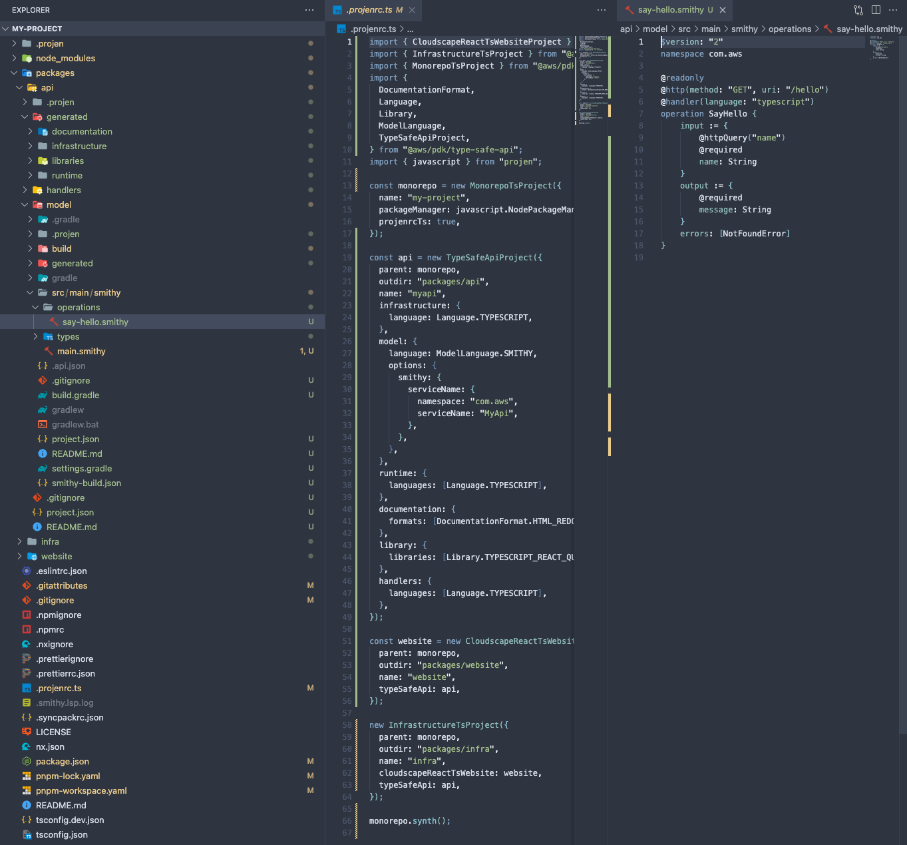

# Getting started

## What is the AWS PDK?

The AWS Project Development Kit (AWS PDK) provides building blocks for common patterns in order to rapidly develop projects in a scalable fashion.

The AWS PDK utilises [Projen](https://github.com/projen/projen) to let you define your projects programatically via the expressive power of type safe constructs available in one of 3 languages (TypeScript, Python or Java). This approach yields many benefits, including:

- Ability to set up new projects within seconds, with all boilerplate already pre-configured.
- Receive updates to previously bootstrapped projects when new versions become available i.e: updated dependenies or lint configurations.
- Build polyglot monorepos, with build caching, cross-language build dependencies, dependency visualization and much more.
- Leverage codified patterns which vend project and infrastructure ([CDK](https://aws.amazon.com/cdk/)) code.

At its core, the AWS PDK is a set of Projen projects, CDK constructs, and tools which work synergistically with one other to provide a rapid and scalable developer experience. Since AWS PDK utilises Projen, the Projen constructs that you compose together need to be defined via a [projenrc](https://projen.io/programmatic-api.html) file.

!!!info
    For more details about AWS PDK, for example the difference between PDK and Projen, check out the [FAQ](../faqs/index.md).

## Why use the AWS PDK?

It's much easier to show than explain! Here is some PDK code (within projenrc file) that creates a Polyglot monorepo, with a React Website pre-configured with Cognito Auth and pre-integrated with a Smithy Type Safe Api.

=== "TYPESCRIPT"

    ```ts
    import { CloudscapeReactTsWebsiteProject } from "@aws/pdk/cloudscape-react-ts-website";
    import { InfrastructureTsProject } from "@aws/pdk/infrastructure";
    import { MonorepoTsProject } from "@aws/pdk/monorepo";
    import {
        DocumentationFormat,
        Language,
        Library,
        ModelLanguage,
        TypeSafeApiProject,
    } from "@aws/pdk/type-safe-api";
    import { javascript } from "projen";

    const monorepo = new MonorepoTsProject({
        name: "my-project",
        packageManager: javascript.NodePackageManager.PNPM,
        projenrcTs: true,
    });

    const api = new TypeSafeApiProject({
        parent: monorepo,
        outdir: "packages/api",
        name: "myapi",
        infrastructure: {
            language: Language.TYPESCRIPT,
        },
        model: {
            language: ModelLanguage.SMITHY,
            options: {
            smithy: {
                serviceName: {
                namespace: "com.aws",
                serviceName: "MyApi",
                },
            },
            },
        },
        runtime: {
            languages: [Language.TYPESCRIPT],
        },
        documentation: {
            formats: [DocumentationFormat.HTML_REDOC],
        },
        library: {
            libraries: [Library.TYPESCRIPT_REACT_QUERY_HOOKS],
        },
        handlers: {
            languages: [Language.TYPESCRIPT],
        },
    });

    const website = new CloudscapeReactTsWebsiteProject({
        parent: monorepo,
        outdir: "packages/website",
        name: "website",
        typeSafeApis: [api],
    });

    new InfrastructureTsProject({
        parent: monorepo,
        outdir: "packages/infra",
        name: "infra",
        cloudscapeReactTsWebsites: [website],
        typeSafeApis: [api],
    });

    monorepo.synth();
    ```

=== "PYTHON"

    ```python
    from aws_pdk.monorepo import MonorepoPythonProject
    from aws_pdk.cloudscape_react_ts_website import CloudscapeReactTsWebsiteProject
    from aws_pdk.infrastructure import InfrastructurePyProject
    from aws_pdk.type_safe_api import *

    monorepo = MonorepoPythonProject(
        module_name="my_project",
        name="my-project",
    )

    api = TypeSafeApiProject(
        name="myapi",
        parent=monorepo,
        outdir="packages/api",
        model=ModelConfiguration(
            language=ModelLanguage.SMITHY,
            options=ModelOptions(
                smithy=SmithyModelOptions(
                    service_name=SmithyServiceName(
                        namespace="com.amazon",
                        service_name="MyAPI"
                    )
                )
            )
        ),
        runtime=RuntimeConfiguration(
            languages=[Language.PYTHON]
        ),
        infrastructure=InfrastructureConfiguration(
            language=Language.PYTHON
        ),
        documentation=DocumentationConfiguration(
            formats=[DocumentationFormat.HTML_REDOC]
        ),
        handlers=HandlersConfiguration(
            languages=[Language.PYTHON]
        ),
        library=LibraryConfiguration(
            libraries=[Library.TYPESCRIPT_REACT_QUERY_HOOKS]
        )
    )

    website = CloudscapeReactTsWebsiteProject(
        parent=monorepo,
        outdir="packages/website",
        type_safe_apis=[api],
        name="website",
    )

    InfrastructurePyProject(
        parent=monorepo,
        outdir="packages/infra",
        name="infra",
        type_safe_apis=[api],
        cloudscape_react_ts_websites=[website]
    )

    monorepo.synth()
    ```

=== "JAVA"

    ```java
    import software.aws.pdk.monorepo.MonorepoJavaProject;
    import software.aws.pdk.monorepo.MonorepoJavaOptions;
    import software.aws.pdk.cloudscape_react_ts_website.CloudscapeReactTsWebsiteProject;
    import software.aws.pdk.cloudscape_react_ts_website.CloudscapeReactTsWebsiteProjectOptions;
    import software.aws.pdk.infrastructure.InfrastructureJavaProject;
    import software.aws.pdk.infrastructure.InfrastructureJavaProjectOptions;
    import software.aws.pdk.type_safe_api.*;
    import java.util.Arrays;

    public class projenrc {
        public static void main(String[] args) {
            MonorepoJavaProject monorepo = new MonorepoJavaProject(MonorepoJavaOptions.builder()
                    .name("my-project")
                    .build());

            TypeSafeApiProject api = new TypeSafeApiProject(TypeSafeApiProjectOptions.builder()
                    .name("myapi")
                    .parent(monorepo)
                    .outdir("packages/api")
                    .model(ModelConfiguration.builder()
                            .language(ModelLanguage.SMITHY)
                            .options(ModelOptions.builder()
                                    .smithy(SmithyModelOptions.builder()
                                            .serviceName(SmithyServiceName.builder()
                                                    .namespace("com.my.company")
                                                    .serviceName("MyApi")
                                                    .build())
                                            .build())
                                    .build())
                            .build())
                    .runtime(RuntimeConfiguration.builder()
                            .languages(Arrays.asList(Language.JAVA))
                            .build())
                    .infrastructure(InfrastructureConfiguration.builder()
                            .language(Language.JAVA)
                            .build())
                    .documentation(DocumentationConfiguration.builder()
                            .formats(Arrays.asList(DocumentationFormat.HTML_REDOC))
                            .build())
                    .library(LibraryConfiguration.builder()
                            .libraries(Arrays.asList(Library.TYPESCRIPT_REACT_QUERY_HOOKS))
                            .build())
                    .handlers(HandlersConfiguration.builder()
                            .languages(Arrays.asList(Language.JAVA))
                            .build())
                    .build());

            CloudscapeReactTsWebsiteProject website = new CloudscapeReactTsWebsiteProject(
                CloudscapeReactTsWebsiteProjectOptions.builder()
                    .parent(monorepo)
                    .outdir("packages/website")
                    .typeSafeApis(Arrays.asList(api))
                    .name("website")
                    .build());

            new InfrastructureJavaProject(
                InfrastructureJavaProjectOptions.builder()
                    .parent(monorepo)
                    .outdir("packages/infra")
                    .name("infra")
                    .typeSafeApis(Arrays.asList(api))
                    .cloudscapeReactTsWebsites(Arrays.asList(website))
                    .build());

            monorepo.synth();
        }
    }
    ```

This code, produces all the source code, packages and infrastructure needed to deploy a fully-operable application in the AWS cloud. All that's left to do is build and deploy it!

From this ~70 lines of code above, the AWS PDK produces the following packages on your behalf:

- `monorepo`: Root level project that manages interdependencies between projects within the Monorepo, provides build caching and dependency visualziation.
- `api/model`: A project that allows you to define your API using Smithy (or OpenAPI) IDL.
- `api/generated/documentation`: A project that automatically creates API documentation in a variety of formats.
- `api/generated/infrastructure`: A project that automatically creates API infrastructure constructs in a type-safe manner.
- `api/generated/libraries`: A project that automatically generates a react hooks library that can be used to call your API from a React based website.
- `api/generated/runtime`: A project that contains server bindings for handlers to ensure type safety.
- `api/handlers`: A project that automatically creates handler stubs, preconfigured with type-safety and a variety of value added features based on your defined API's.
- `website`: A project which creates a React based website built using [Cloudscape](https://cloudscape.design/) that comes pre-integrated with Cognito Auth and your created API. This provides you with the ability to call your API securely.
- `infra`: A project which sets up all CDK related infrastructure needed to deploy your application. It also comes pre-configured to generate a diagram based on your CDK code everytime you build.

=== "Bootstrapped Source"
    

=== "Generated Website"
    

=== "Generated Diagram"
    

As you can see, the AWS PDK provides you with valuable time savings so you can focus on working on what matters most to your project.

## Developing with the AWS PDK

It's easy to [get set up](../getting_started/index.md) and [write your first AWS PDK project](../getting_started/your_first_aws_pdk_project.md). Short code samples are available throughout the [Developer Guide](../developer_guides/index.md) in all of the AWS PDK's supported languages: `Typescript`, `Python`, & `Java`.

## Contributing to the AWS PDK

Because the AWS PDK is open source, the team encourages you to contribute to make it an even better framework. For details, see [contributing](../contributing/index.md).