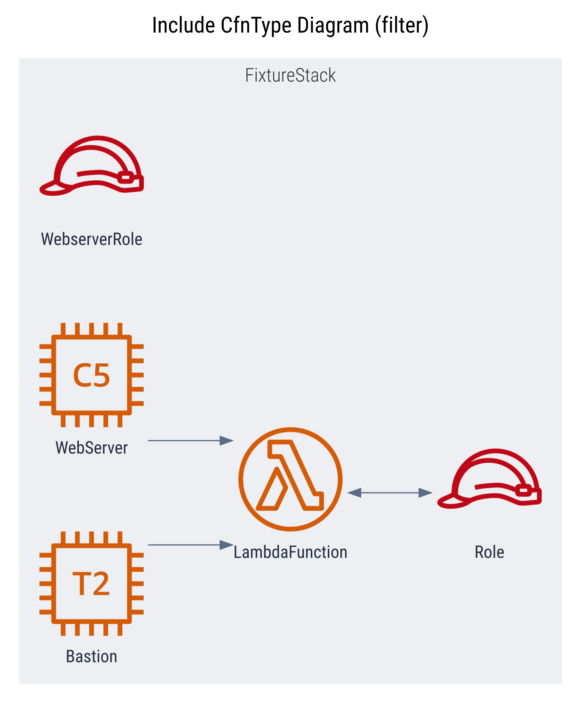

## Diagram Plugin - Cdk Graph
`@aws-prototyping-skd/cdk-graph-plugin-diagram`


 \
[](https://aws.github.io/aws-prototyping-sdk/typescript/cdk-graph-plugin-diagram/index.html)
[](https://github.com/aws/aws-prototyping-sdk/tree/mainline/packages/cdk-graph-plugin-diagram)

This plugins generates diagrams utilizing the [cdk-graph](https://aws.github.io/aws-prototyping-sdk/typescript/cdk-graph/index.html) framework.

> More comprehensive documentation to come as this package stabilizes.

> **Disclaimer:** This is the first **cdk graph** plugin, it is highly *experimental*, and subject to major refactors as we gain feedback from the community.

| | |
| --- | --- |
|  |  |


### Quick Start
```ts
// bin/app.ts
(async () => {
  const app = new App();
  // ... add stacks, etc
  const graph = new CdkGraph(app, {
    plugins: [new CdkGraphDiagramPlugin()],
  });

  app.synth();

  await graph.report();
})

// => cdk.out/diagram.dot
// => cdk.out/diagram.svg
// => cdk.out/diagram.png
```

> This plugin current only support `async report()` generation follow the above example code.

---
### Diagram Providers

#### **1) [Graphviz / Dot](https://graphviz.org/)**


| Format | Status | Extends |
| --- | --- | --- |
| [DOT](https://graphviz.org/docs/outputs/canon/) |  | - |
| [SVG](https://graphviz.org/docs/outputs/svg/) |  | [DOT](https://graphviz.org/docs/outputs/canon/) |
| [PNG](https://graphviz.org/docs/outputs/png/) |  | [SVG](https://graphviz.org/docs/outputs/canon/) |

**Examples**
| | | |
| --- | --- | --- |
| Default | Multi Stack | Staged |
| [](docs/examples/diagram.png) | [](docs/examples/multi-stack.png) | [](docs/examples/staged.png) |
| Focus | Verbose | |
| [](docs/examples/focus-nohoist.png) | [](docs/examples/verbose.png) | |
| Dark | Dark Services | Dark Verbose |
| [](docs/examples/dark.png) | [](docs/examples/verbose-services.png) | [](docs/examples/dark-verbose.png) |

#### **2) [Diagram.net / Drawio](https://www.diagrams.net/)**

 _very early stage design and development_

To support editing of generated diagram and increase downstream integration, the plugin is planning to support [diagram.net](https://www.diagrams.net/) based diagrams.


---

### Configuration

See [API Documentation](https://aws.github.io/aws-prototyping-sdk/typescript/cdk-graph-plugin-diagram/index.html) for details, and look in [unit tests](https://github.com/aws/aws-prototyping-sdk/tree/mainline/packages/cdk-graph-plugin-diagram/test/graphviz) for more examples.

#### Example Configurations (expand below)

##### **Presets**

<details>
<summary>Preset: compact</summary>

[](docs/examples/compact.png)

```ts
{
  name: "compact",
  title: "Compact Diagram",
  filterPlan: {
    preset: FilterPreset.COMPACT,
  },
},
```
</details>

<details>
<summary>Preset: verbose</summary>

[](docs/examples/verbose.png)

```ts
{
  name: "verbose",
  title: "Verbose Diagram",
  format: DiagramFormat.PNG,
  ignoreDefaults: true,
},
```
</details>

##### **Focus**

<details>
<summary>Focus: hoist</summary>

[](docs/examples/focus.png)

```ts
{
  name: "focus",
  title: "Focus Lambda Diagram (non-extraneous)",
  filterPlan: {
    focus: (store) =>
      store.getNode(getConstructUUID(app.stack.lambda)),
    preset: FilterPreset.NON_EXTRANEOUS,
  },
  ignoreDefaults: true,
},
```
</details>

<details>
<summary>Focus: no hoist</summary>

[](docs/examples/focus-nohoist.png)

```ts
{
  name: "focus-nohoist",
  title: "Focus WebServer Diagram (noHoist, verbose)",
  filterPlan: {
    focus: {
      node: (store) =>
        store.getNode(getConstructUUID(app.stack.webServer)),
      noHoist: true,
    },
  },
  ignoreDefaults: true,
},
```
</details>

##### **Filters**

<details>
<summary>Filter: Include specific cfn resource types</summary>

[](docs/examples/filter-cfntype-include.png)

```ts
{
  name: "includeCfnType",
  title: "Include CfnType Diagram (filter)",
  filterPlan: {
    filters: [
      Filters.includeCfnType([
        aws_arch.CfnSpec.ServiceResourceDictionary.EC2.Instance,
        /AWS::Lambda::Function.*/,
        "AWS::IAM::Role",
      ]),
      Filters.compact(),
    ],
  },
},
```
</details>

<details>
<summary>Filter: Exclude specific cfn resource types</summary>

[](docs/examples/filter-cfntype-exclude.png)

```ts
{
  name: "excludeCfnType",
  title: "Exclude CfnType Diagram (filter)",
  filterPlan: {
    filters: [
      Filters.excludeCfnType([
        /AWS::EC2::VPC.*/,
        aws_arch.CfnSpec.ServiceResourceDictionary.IAM.Role,
      ]),
      Filters.compact(),
    ],
  },
},
```
</details>

<details>
<summary>Filter: Include specific graph node types</summary>

[](docs/examples/filter-nodetype-include.png)

```ts
{
  name: "includeNodeType",
  title: "Include NodeType Diagram (filter)",
  filterPlan: {
    filters: [
      Filters.includeNodeType([
        NodeTypeEnum.STACK,
        NodeTypeEnum.RESOURCE,
      ]),
      Filters.compact(),
    ],
  },
},
```
</details>

<details>
<summary>Filter: Include specific graph node types</summary>

[](docs/examples/filter-nodetype-include.png)

```ts
{
  name: "includeNodeType",
  title: "Include NodeType Diagram (filter)",
  filterPlan: {
    filters: [
      Filters.includeNodeType([
        NodeTypeEnum.STACK,
        NodeTypeEnum.RESOURCE,
      ]),
      Filters.compact(),
    ],
  },
},
```
</details>

<details>
<summary>Filter: Exclude specific graph node types</summary>

[](docs/examples/filter-nodetype-exclude.png)

```ts
{
  name: "excludeNodeType",
  title: "Exclude NodeType Diagram (filter)",
  filterPlan: {
    filters: [
      Filters.excludeNodeType([
        NodeTypeEnum.NESTED_STACK,
        NodeTypeEnum.CFN_RESOURCE,
        NodeTypeEnum.OUTPUT,
        NodeTypeEnum.PARAMETER,
      ]),
      Filters.compact(),
    ],
  },
},
```
</details>

##### **Themes**

<details>
<summary>Theme: Dark</summary>

[](docs/examples/dark.png)

```ts
{
  name: "Dark",
  title: "Dark Theme Diagram",
  theme: theme,
},
```
</details>

<details>
<summary>Theme: Dark - render service icons</summary>

[](docs/examples/dark-services.png)

```ts
{
  name: "dark-services",
  title: "Dark Theme Custom Diagram",
  theme: {
    theme: theme,
    rendering: {
      resourceIconMin: GraphThemeRenderingIconTarget.SERVICE,
      resourceIconMax: GraphThemeRenderingIconTarget.CATEGORY,
      cfnResourceIconMin: GraphThemeRenderingIconTarget.DATA,
      cfnResourceIconMax: GraphThemeRenderingIconTarget.RESOURCE,
    },
  },
},
```
</details>
<details>
<summary>Theme: Dark - verbose</summary>

[](docs/examples/dark-verbose.png)

```ts
{
  name: "dark-verbose",
  title: "Dark Theme Verbose Diagram",
  ignoreDefaults: true,
  theme: theme,
},
```
</details>

---

### Next Steps
- [ ] Battle test in the wild and get community feedback
- [ ] Improve image coverage and non-image node rendering
- [ ] Add drawio support
- [ ] Add common filter patterns and helpers
- [ ] Enable generating diagrams outside of synthesis process (maybe CLI)
- [ ] Implement interactive diagram, with potential for dynamic filtering and config generation
- [ ] Support using interactive diagram as config generator for other plugins (or as separate plugin that depends on this)

---

Inspired by [cdk-dia](https://github.com/pistazie/cdk-dia) and [cfn-dia](https://github.com/mhlabs/cfn-diagram) with ❤️
