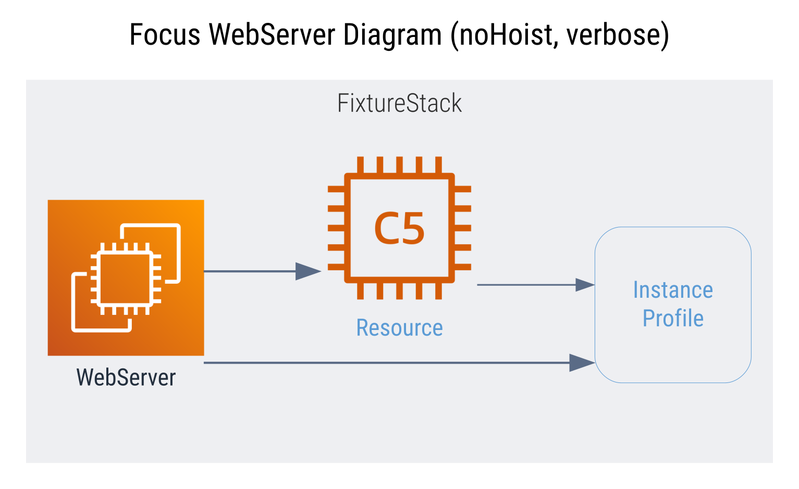
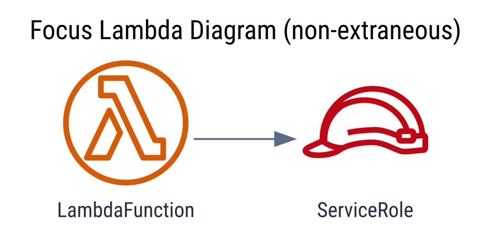

## Diagram Plugin - Cdk Graph
`@aws-prototyping-skd/cdk-graph-plugin-diagram`

<style>
img { max-width: 200px; max-height: 200px; }
section img { max-width: 400px; max-height: 400px; }
</style>


 \
[](https://aws.github.io/aws-prototyping-sdk/typescript/cdk-graph-plugin-diagram/index.html)
[](https://github.com/aws/aws-prototyping-sdk/tree/mainline/packages/cdk-graph-plugin-diagram)

This plugins generates diagrams utilizing the [cdk-graph](https://aws.github.io/aws-prototyping-sdk/typescript/cdk-graph/index.html) framework.

> More comprehensive documentation to come as this package stabilizes.

> **Disclaimer:** This is the first **cdk graph** plugin, it is highly *experimental*, and subject to major refactors as we gain feedback from the community.
<section>
  
  
</section>

### Quick Start
```ts
// bin/app.ts
(async () => {
  const app = new App();
  // ... add stacks, etc
  const graph = new CdkGraph(app, {
    plugins: [new CdkGraphDiagramPlugin()],
  });

  app.synth();

  await graph.report();
})

// => cdk.out/diagram.dot
// => cdk.out/diagram.svg
// => cdk.out/diagram.png
```

> This plugin current only support `async report()` generation follow the above example code.

---
### Diagram Providers

#### **1) [Graphviz / Dot](https://graphviz.org/)**


| Format | Status | Extends |
| --- | --- | --- |
| [DOT](https://graphviz.org/docs/outputs/canon/) |  | - |
| [SVG](https://graphviz.org/docs/outputs/svg/) |  | [DOT](https://graphviz.org/docs/outputs/canon/) |
| [PNG](https://graphviz.org/docs/outputs/png/) |  | [SVG](https://graphviz.org/docs/outputs/canon/) |

**Examples**
| | | |
| --- | --- | --- |
| Default | Multi Stack | Staged |
| [](docs/examples/diagram.png) | [](docs/examples/multi-stack.png) | [](docs/examples/staged.png) |
| Focus | Verbose | |
| [](docs/examples/focus-nohoist.png) | [](docs/examples/verbose.png) | |
| Dark | Dark Services | Dark Verbose |
| [](docs/examples/dark.png) | [](docs/examples/verbose-services.png) | [](docs/examples/dark-verbose.png) |

#### **2) [Diagram.net / Drawio](https://www.diagrams.net/)**

 _very early stage design and development_

To support editing of generated diagram and increase downstream integration, the plugin is planning to support [diagram.net](https://www.diagrams.net/) based diagrams.


---

### Configuration

See [API Documentation](https://aws.github.io/aws-prototyping-sdk/typescript/cdk-graph-plugin-diagram/index.html) for details, and look in [unit tests](https://github.com/aws/aws-prototyping-sdk/tree/mainline/packages/cdk-graph-plugin-diagram/test/graphviz) for examples.

#### Example Configurations (expand below)

<details>
<summary>Preset and filter examples</summary>

```ts
(async() => {
  const app = new cdk.App();
  // ...<cdk construct code here>
  const plugin = new CdkGraphDiagramPlugin({
    diagrams: [
      {
        name: "compact",
        title: "Compact Diagram",
        filterPlan: {
          preset: FilterPreset.COMPACT,
        },
      },
      {
        name: "verbose",
        title: "Verbose Diagram",
        format: DiagramFormat.PNG,
        ignoreDefaults: true,
      },
      {
        name: "focus",
        title: "Focus Lambda Diagram (non-extraneous)",
        filterPlan: {
          focus: (store) =>
            store.getNode(getConstructUUID(app.stack.lambda)),
          preset: FilterPreset.NON_EXTRANEOUS,
        },
        ignoreDefaults: true,
      },
      {
        name: "focus-nohoist",
        title: "Focus WebServer Diagram (noHoist, verbose)",
        filterPlan: {
          focus: {
            node: (store) =>
              store.getNode(getConstructUUID(app.stack.webServer)),
            noHoist: true,
          },
        },
        ignoreDefaults: true,
      },
    ],
  });
  graph = new CdkGraph(app, {
    plugins: [plugin],
  });

  app.synth();

  // plugin requires async report to be called
  await graph.report();
})();
```

| Diagram | |
| --- | --- |
| Compact | [](docs/examples/compact.png) |
| Verbose | [](docs/examples/verbose.png) |
| Focus | [](docs/examples/focus.png) |
| Focus (no-hoist) | [](docs/examples/focus-nohoist.png) |

</details>

<details>
<summary>Theme examples</summary>

```ts
(async() => {
  const app = new cdk.App();
  // ...<cdk construct code here>
  const plugin = new CdkGraphDiagramPlugin({
    diagrams: [
      {
        name: theme,
        title: `${capitalize(theme)} Theme Diagram`,
        theme: theme,
      },
      {
        name: `${theme}-custom`,
        title: `${capitalize(theme)} Theme Custom Diagram`,
        theme: {
          theme: theme,
          rendering: {
            resourceIconMin: GraphThemeRenderingIconTarget.SERVICE,
            resourceIconMax: GraphThemeRenderingIconTarget.CATEGORY,
            cfnResourceIconMin: GraphThemeRenderingIconTarget.DATA,
            cfnResourceIconMax: GraphThemeRenderingIconTarget.RESOURCE,
          },
        },
      },
      {
        name: `${theme}-verbose`,
        title: `${capitalize(theme)} Theme Verbose Diagram`,
        ignoreDefaults: true,
        theme: theme,
      },
    ],
  });
  graph = new CdkGraph(app, {
    plugins: [plugin],
  });

  app.synth();

  // plugin requires async report to be called
  await graph.report();
})();
```

| Diagram | |
| --- | --- |
| Dark | [](docs/examples/dark.png) |
| Dark Services | [](docs/examples/verbose-services.png) |
| Dark (verbose) | [](docs/examples/dark-verbose.png) |

</details>

---

### Next Steps
- [ ] Battle test in the wild and get community feedback
- [ ] Improve image coverage and non-image node rendering
- [ ] Add drawio support
- [ ] Add common filter patterns and helpers
- [ ] Enable generating diagrams outside of synthesis process (maybe CLI)
- [ ] Implement interactive diagram, with potential for dynamic filtering and config generation
- [ ] Support using interactive diagram as config generator for other plugins (or as separate plugin that depends on this)

---

Inspired by [cdk-dia](https://github.com/pistazie/cdk-dia) and [cfn-dia](https://github.com/mhlabs/cfn-diagram) with ❤️
