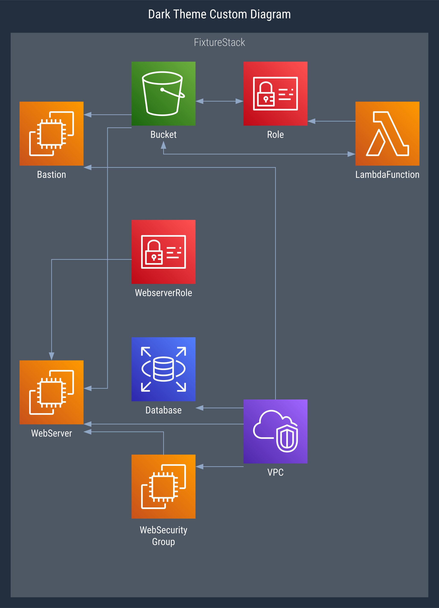
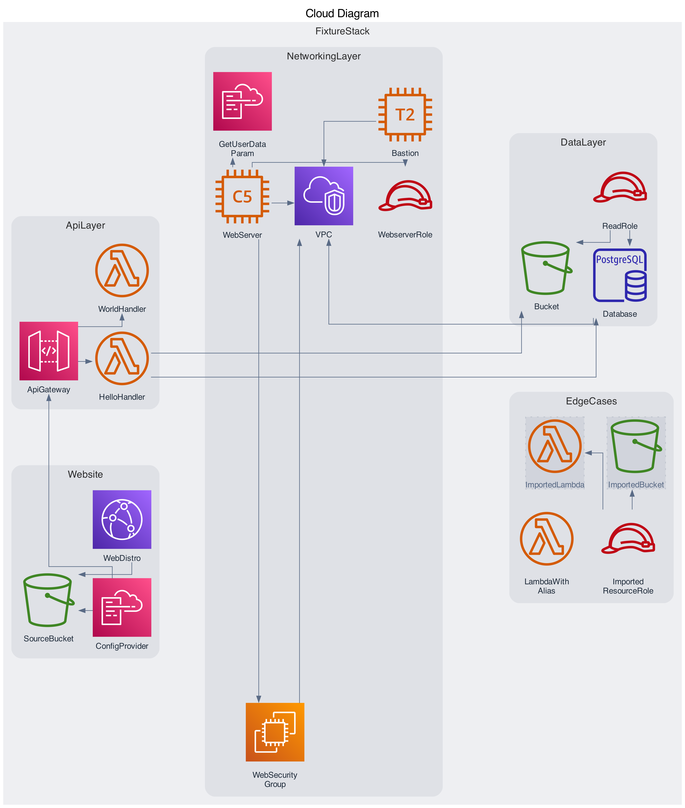

# Cdk Graph Diagram Plugin


[](../../api/typescript/cdk-graph-plugin-diagram/index.md)
[](https://github.com/aws/aws-pdk/tree/mainline/packages/cdk-graph-plugin-diagram)

> This plugin generates diagrams utilizing the [cdk-graph](https://aws.github.io/aws-pdk/typescript/cdk-graph/index.html) framework.

|                                                                             |                                                                          |
| --------------------------------------------------------------------------- | ------------------------------------------------------------------------ |
|  |  |

### Quick Start

```ts
// bin/app.ts

// Must wrap cdk app with async IIFE function to enable async cdk-graph report
(async () => {
  const app = new App();
  // ... add stacks, etc
  const graph = new CdkGraph(app, {
    plugins: [new CdkGraphDiagramPlugin()],
  });

  app.synth();

  // async cdk-graph reporting hook
  await graph.report();
})();

// => cdk.out/diagram.dot
// => cdk.out/diagram.svg
// => cdk.out/diagram.png
```

> This plugin currently only supports `async report()` generation following the above example. **Make sure to wrap the cdk app with _async IIFE_.**

### Supported Formats

| Format                                          | Status                                                     | Extends                                         | Provider                             |
| ----------------------------------------------- | ---------------------------------------------------------- | ----------------------------------------------- | ------------------------------------ |
| [DOT](https://graphviz.org/docs/outputs/canon/) |  | -                                               | [Graphviz](./graphviz.md) |
| [SVG](https://graphviz.org/docs/outputs/svg/)   |  | [DOT](https://graphviz.org/docs/outputs/canon/) | [Graphviz](./graphviz.md) |
| [PNG](https://graphviz.org/docs/outputs/png/)   |  | [SVG](https://graphviz.org/docs/outputs/canon/) | [Graphviz](./graphviz.md) |

---

### Diagram Providers

| Provider                             | Status                                                         | Formats                                                                                                                                       |
| ------------------------------------ | -------------------------------------------------------------- | --------------------------------------------------------------------------------------------------------------------------------------------- |
| [Graphviz](./graphviz.md) |  | [DOT](https://graphviz.org/docs/outputs/canon/), [SVG](https://graphviz.org/docs/outputs/svg/), [PNG](https://graphviz.org/docs/outputs/png/) |
| [Drawio](./drawio.md)     |   | _TBD: very early stage design and development_                                                                                                |

---

### Configuration

See [IPluginConfig](https://aws.github.io/aws-pdk/api/typescript/cdk-graph-plugin-diagram/index.html#ipluginconfig) interface for details, and look in [unit tests](https://github.com/aws/aws-pdk/tree/mainline/packages/cdk-graph-plugin-diagram/test/graphviz) for additional examples.

By default the diagram plugin will generate a single "compact" preset diagram.
It is capable of creating multiple diagrams each with different configurations, as well as defining the defaults to use.

**Defaults Option**

Changing the `defaults` option will modify default options for all diagrams, including the default diagram.

> See [IDiagramConfigBase](https://aws.github.io/aws-pdk/api/typescript/cdk-graph-plugin-diagram/index.html#idiagramconfigbase) interface for `plugin.defaults` options.

```ts
new CdkGraphDiagramPlugin({
  defaults: {
    theme: "dark",
    filterPlan: {
      preset: FilterPreset.NONE,
    },
  },
});

// => results in a single diagram that is "verbose" and "dark", since no resources are filtered
```

**Diagrams Option**

By modifying the `diagrams` option of the plugin you have full control over the rendering of diagrams, and can render **multiple** diagrams.

> See [IDiagramConfig](https://aws.github.io/aws-pdk/api/typescript/cdk-graph-plugin-diagram/index.html#idiagramconfig) interface for diagram config options.

```ts
new CdkGraphDiagramPlugin({
  diagrams: [
    {
      name: "diagram-1",
      title: "Diagram 1 (dark + compact)",
      theme: "dark",
      // the default `filterPlan: { preset: FilterPreset.COMPACT }` will still apply
    },
    {
      name: "diagram-2",
      title: "Diagram 2 (dark + verbose)",
      theme: "dark",
      filterPlan: {
        preset: FilterPreset.NONE,
      },
    },
    {
      name: "diagram-3",
      title: "Diagram 3 (no defaults)",
      ignoreDefaults: true, // default options will not be applied (theme, filterPlan, etc)
    },
  ],
});
```

#### Example Diagram Configs (expand below)

The below examples define individual diagram configs in the `diagrams` options of the plugin as described above.

```ts
new CdkGraphDiagramPlugin({
  diagrams: [
    // ... insert diagram  config(s) here - see below for examples
  ],
});
```

##### **Presets**

<details>
<summary>Preset: compact</summary>


```ts
{
  name: "compact",
  title: "Compact Diagram",
  filterPlan: {
    preset: FilterPreset.COMPACT,
  },
},
```

</details>

<details>
<summary>Preset: verbose</summary>


```ts
{
  name: "verbose",
  title: "Verbose Diagram",
  format: DiagramFormat.PNG,
  ignoreDefaults: true,
},
```

</details>

##### **Focus**

<details>
<summary>Focus: hoist</summary>


```ts
{
  name: "focus",
  title: "Focus Lambda Diagram (non-extraneous)",
  filterPlan: {
    focus: {
        filter: {
            filter: (store) =>
                store.getNode(getConstructUUID(app.stack.lambda)),
            },
        },
    preset: FilterPreset.NON_EXTRANEOUS,
  },
  ignoreDefaults: true,
},
```

</details>

<details>
<summary>Focus: no hoist</summary>


```ts
{
  name: "focus",
  title: "Focus Lambda Diagram (non-extraneous)",
  filterPlan: {
    focus: {
        filter: {
            filter: (store) =>
                store.getNode(getConstructUUID(app.stack.lambda)),
        },
        noHoist: true,
    },
    preset: FilterPreset.NON_EXTRANEOUS,
  },
  ignoreDefaults: true,
},
```

</details>

##### **Filters**

<details>
<summary>Filter: Include specific cfn resource types</summary>


```ts
{
  name: "includeCfnType",
  title: "Include CfnType Diagram (filter)",
  filterPlan: {
    filters: [
      {
        graph: Filters.includeCfnType([
          aws_arch.CfnSpec.ServiceResourceDictionary.EC2.Instance,
          /AWS::Lambda::Function.*/,
          "AWS::IAM::Role",
        ]),
      },
      { store: Filters.compact() },
    ],
  },
},
```

</details>

<details>
<summary>Filter: Exclude specific cfn resource types</summary>


```ts
{
  name: "excludeCfnType",
  title: "Exclude CfnType Diagram (filter)",
  filterPlan: {
    filters: [
      {
        graph: Filters.excludeCfnType([
          /AWS::EC2::VPC.*/,
          aws_arch.CfnSpec.ServiceResourceDictionary.IAM.Role,
        ]),
      },
      { store: Filters.compact() },
    ],
  },
},
```

</details>

<details>
<summary>Filter: Include specific graph node types</summary>


```ts
{
  name: "includeNodeType",
  title: "Include NodeType Diagram (filter)",
  filterPlan: {
    filters: [
      {
        graph: Filters.includeNodeType([
          NodeTypeEnum.STACK,
          NodeTypeEnum.RESOURCE,
        ]),
      },
      { store: Filters.compact() },
    ],
  },
},
```

</details>

<details>
<summary>Filter: Exclude specific graph node types</summary>


```ts
{
  name: "excludeNodeType",
  title: "Exclude NodeType Diagram (filter)",
  filterPlan: {
    filters: [
      {
        graph: Filters.excludeNodeType([
          NodeTypeEnum.NESTED_STACK,
          NodeTypeEnum.CFN_RESOURCE,
          NodeTypeEnum.OUTPUT,
          NodeTypeEnum.PARAMETER,
        ])
      },
      { store: Filters.compact() },
    ],
  },
},
```

</details>

##### **Themes**

<details>
<summary>Theme: Dark</summary>


```ts
{
  name: "Dark",
  title: "Dark Theme Diagram",
  theme: theme,
},
```

</details>

<details>
<summary>Theme: Dark - render service icons</summary>



```ts
{
  name: "dark-services",
  title: "Dark Theme Custom Diagram",
  theme: {
    theme: theme,
    rendering: {
      resourceIconMin: GraphThemeRenderingIconTarget.SERVICE,
      resourceIconMax: GraphThemeRenderingIconTarget.CATEGORY,
      cfnResourceIconMin: GraphThemeRenderingIconTarget.DATA,
      cfnResourceIconMax: GraphThemeRenderingIconTarget.RESOURCE,
    },
  },
},
```

</details>
<details>
<summary>Theme: Dark - verbose</summary>


```ts
{
  name: "dark-verbose",
  title: "Dark Theme Verbose Diagram",
  ignoreDefaults: true,
  theme: theme,
},
```

</details>

##### **Node Positions**

<details>
<summary>Fixed y-coordinate for a node</summary>



```ts
{
  nodePositions: {
    WebServer: { x: 0, y: 10 },
  },
},
```

</details>

<details>

---

### Future Enhancements

- [ ] Improve image coverage and non-image node rendering
- [ ] Add drawio support
- [ ] Add common filter patterns and helpers
- [ ] Enable generating diagrams outside of synthesis process (maybe CLI)
- [ ] Implement interactive diagram, with potential for dynamic filtering and config generation
- [ ] Support using interactive diagram as config generator for other plugins (or as separate plugin that depends on this)

---

Inspired by [cdk-dia](https://github.com/pistazie/cdk-dia) and [cfn-dia](https://github.com/mhlabs/cfn-diagram) with ❤️
