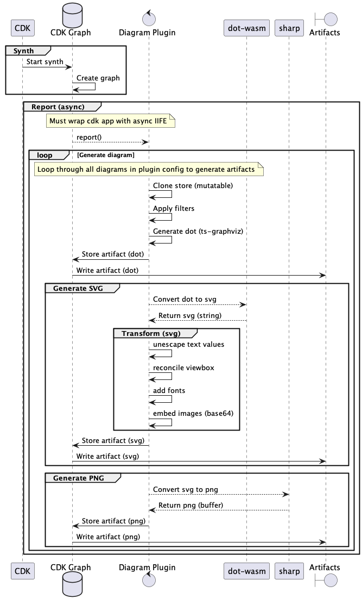

## [Graphviz](https://graphviz.org/) Provider

| Format | Status | Extends |
| --- | --- | --- |
| [DOT](https://graphviz.org/docs/outputs/canon/) |  | - |
| [SVG](https://graphviz.org/docs/outputs/svg/) |  | [DOT](https://graphviz.org/docs/outputs/canon/) |
| [PNG](https://graphviz.org/docs/outputs/png/) |  | [SVG](https://graphviz.org/docs/outputs/canon/) |

### Examples
| | | |
| --- | --- | --- |
| Default | Multi Stack | Staged |
|  |  |  |
| Focus | Verbose | |
|  |  | |
| Dark | Dark Services | Dark Verbose |
|  |  |  |

---
### How it works

