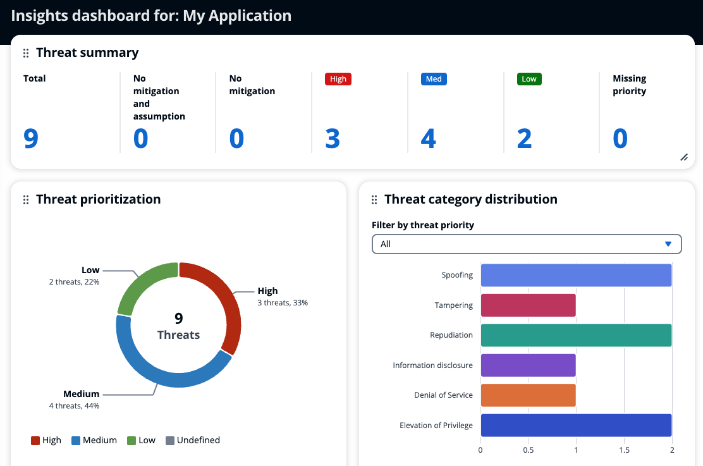

# Cdk Graph Threat Composer Plugin


[](../../api/typescript/cdk-graph-plugin-threat-composer/index.md)
[](https://github.com/aws/aws-pdk/tree/mainline/packages/cdk-graph-plugin-threat-composer)

> This plugin generates [Threat Composer](https://github.com/awslabs/threat-composer) threat models, utilizing the [cdk-graph](https://aws.github.io/aws-pdk/typescript/cdk-graph/index.html) framework.



### Quick Start

```ts
// bin/app.ts

// Must wrap cdk app with async IIFE function to enable async cdk-graph report
(async () => {
  const app = PDKNag.app();
  // ... add stacks, etc
  const graph = new CdkGraph(app, {
    plugins: [
      // Configure the plugin
      new CdkGraphThreatComposerPlugin({
        applicationDetails: {
          name: "My Application"
        },
      }),
    ],
  });

  app.synth();

  // async cdk-graph reporting hook
  await graph.report();
})();

// => cdk.out/cdkgraph/threat-model.tc.json
```

!!!warning
    This plugin must be used in tandem with [pdk-nag](../../developer_guides/pdk-nag/index.md), using `PDKNag.app()`

> This plugin currently only supports `async report()` generation following the above example. **Make sure to wrap the cdk app with _async IIFE_.**

### How it Works

This plugin uses the [CDK Nag](https://github.com/cdklabs/cdk-nag) findings from your [pdk-nag](../../developer_guides/pdk-nag/index.md) app to generate a starter [Threat Composer](https://github.com/awslabs/threat-composer) threat model for you.

Upon configuring the plugin and synthesizing CDK, you'll find a `cdk.out/cdkgraph/threat-composer.tc.json` file in your project. You can import this into the [Threat Composer](https://awslabs.github.io/threat-composer/) tool to view and edit your threat model.

!!!note
    The generated threat model is not complete, however it provides a good starting point for you to consider possible threats to your application and how they are mitigated.

    After editing your threat model, it's recommended that you manage it as part of your codebase by checking it into version control.

This plugin generates the threat model based on a hand-crafted mapping of CDK Nag rules to the threats which they intend to mitigate.

### Architecture Diagram

Specify this plugin after the [CDK Graph Diagram Plugin](../../developer_guides/cdk-graph-plugin-diagram/index.md) to automatically include a generated architecture diagram in your threat model.

```ts
(async () => {
  const app = PDKNag.app();
  // ... add stacks, etc
  const graph = new CdkGraph(app, {
    plugins: [
      new CdkGraphDiagramPlugin(),
      // Configure the plugin after the cdk graph diagram plugin
      new CdkGraphThreatComposerPlugin(),
    ],
  });

  app.synth();

  await graph.report();
})();
```
